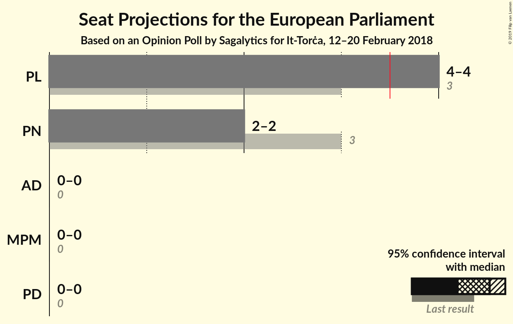

# Opinion Poll by Sagalytics for It-Torċa, 12–20 February 2018

<a href="#voting-intentions">Voting Intentions</a> | <a href="#seats">Seats</a> | <a href="#coalitions">Coalitions</a> | <a href="#technical-information">Technical Information</a>

## Voting Intentions

### Confidence Intervals

| Party | Last Result | Poll Result | 80% Confidence Interval | 90% Confidence Interval | 95% Confidence Interval | 99% Confidence Interval |
|:-----:|:-----------:|:-----------:|:-----------------------:|:-----------------------:|:-----------------------:|:-----------------------:|
| Partit Laburista (S&D) | 53.4% | 60.6% | 57.6–63.5% |56.8–64.3% |56.1–65.0% |54.6–66.3% |
| Partit Nazzjonalista (EPP) | 40.0% | 37.4% | 34.6–40.4% |33.8–41.2% |33.2–42.0% |31.8–43.4% |

*Note:* The poll result column reflects the actual value used in the calculations. Published results may vary slightly, and in addition be rounded to fewer digits.

## Seats

### Confidence Intervals

| Party | Last Result | Median | 80% Confidence Interval | 90% Confidence Interval | 95% Confidence Interval | 99% Confidence Interval |
|:-----:|:-----------:|:------:|:-----------------------:|:-----------------------:|:-----------------------:|:-----------------------:|
| <a href="#partit-laburista-(s&d)">Partit Laburista (S&D)</a> | 3 | 4 | 4 |4 |4 |3–4 |
| <a href="#partit-nazzjonalista-(epp)">Partit Nazzjonalista (EPP)</a> | 3 | 2 | 2 |2 |2 |2–3 |

### Partit Laburista (S&D)

*For a full overview of the results for this party, see the [Partit Laburista (S&D)](party-partitlaburistasd.html) page.*

| Number of Seats | Probability | Accumulated | Special Marks |
|:---------------:|:-----------:|:-----------:|:-------------:|
| 3 | 2% | 100% | Last Result |
| 4 | 98% | 98% | Median, Majority |
| 5 | 0% | 0% |  |

### Partit Nazzjonalista (EPP)

*For a full overview of the results for this party, see the [Partit Nazzjonalista (EPP)](party-partitnazzjonalistaepp.html) page.*

| Number of Seats | Probability | Accumulated | Special Marks |
|:---------------:|:-----------:|:-----------:|:-------------:|
| 2 | 98% | 100% | Median |
| 3 | 2% | 2% | Last Result |
| 4 | 0% | 0% | Majority |

## Coalitions

### Confidence Intervals

| Coalition | Last Result | Median | Majority? | 80% Confidence Interval | 90% Confidence Interval | 95% Confidence Interval | 99% Confidence Interval |
|:---------:|:-----------:|:------:|:---------:|:-----------------------:|:-----------------------:|:-----------------------:|:-----------------------:|
| Partit Laburista (S&D) | 3 | 4 | 98% | 4 | 4 | 4 | 3–4 |
| Partit Nazzjonalista (EPP) | 3 | 2 | 0% | 2 | 2 | 2 | 2–3 |

### Partit Laburista (S&D)

| Number of Seats | Probability | Accumulated | Special Marks |
|:---------------:|:-----------:|:-----------:|:-------------:|
| 3 | 2% | 100% | Last Result |
| 4 | 98% | 98% | Median, Majority |
| 5 | 0% | 0% |  |

### Partit Nazzjonalista (EPP)

| Number of Seats | Probability | Accumulated | Special Marks |
|:---------------:|:-----------:|:-----------:|:-------------:|
| 2 | 98% | 100% | Median |
| 3 | 2% | 2% | Last Result |
| 4 | 0% | 0% | Majority |

## Technical Information

### Opinion Poll

+ **Polling firm:** Sagalytics
+ **Commissioner(s):** It-Torċa
+ **Fieldwork period:** 12–20 February 2018

### Calculations

+ **Sample size:** 462
+ **Simulations done:** 131,072
+ **Error estimate:** 0.21%

