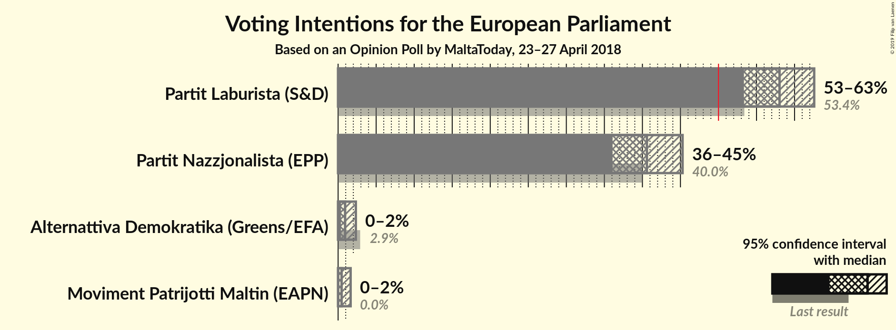
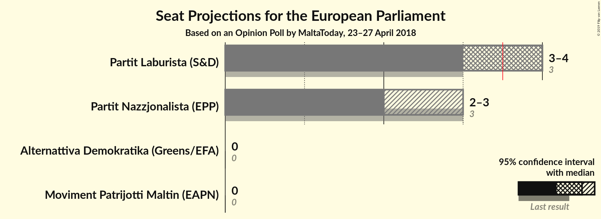
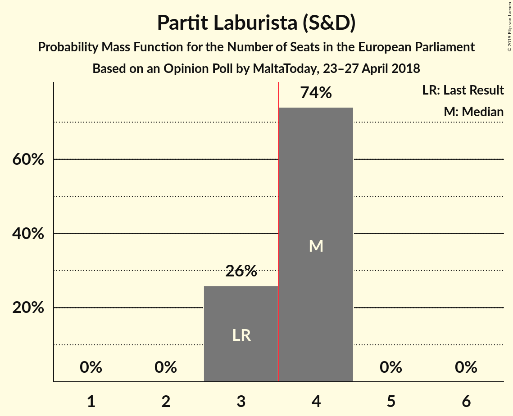
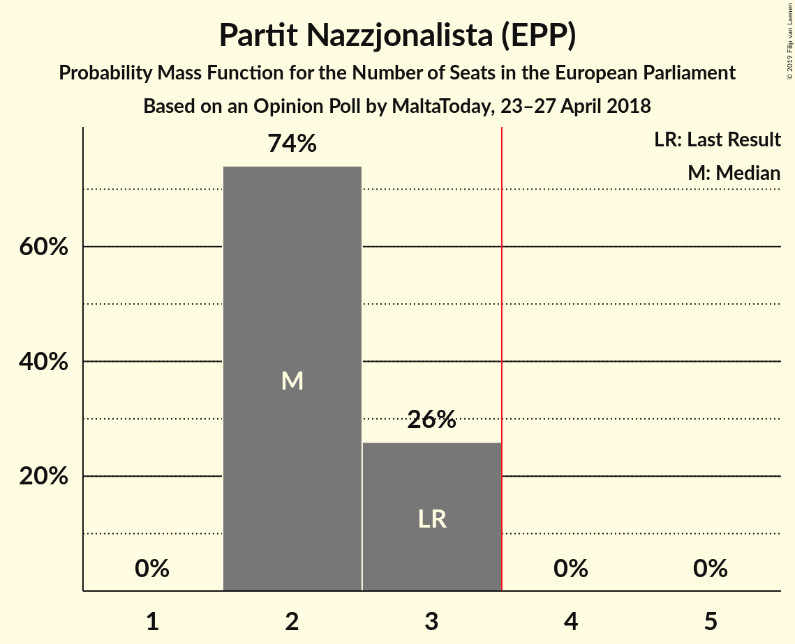
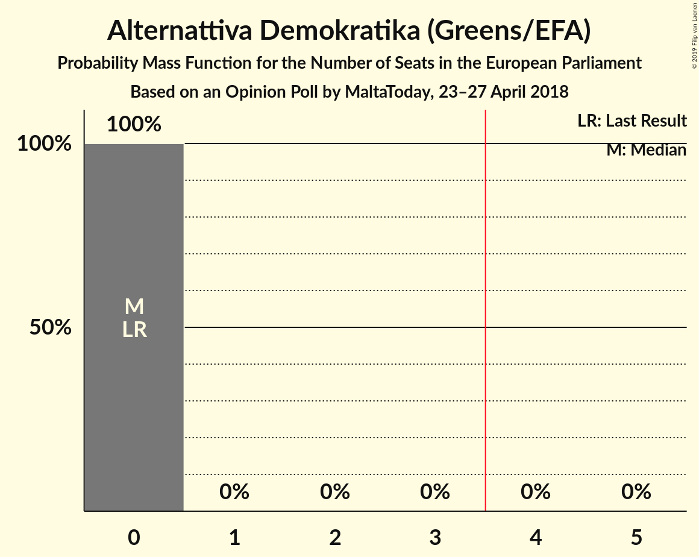
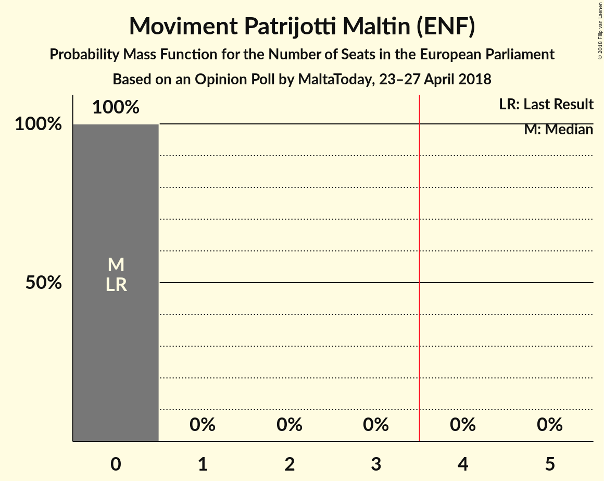
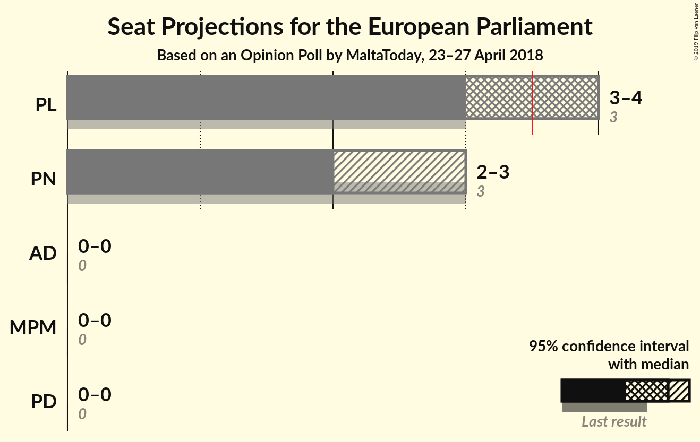

# Opinion Poll by MaltaToday, 23–27 April 2018

<a href="#voting-intentions">Voting Intentions</a> | <a href="#seats">Seats</a> | <a href="#coalitions">Coalitions</a> | <a href="#technical-information">Technical Information</a>

## Voting Intentions

### Confidence Intervals

| Party | Last Result | Poll Result | 80% Confidence Interval | 90% Confidence Interval | 95% Confidence Interval | 99% Confidence Interval |
|:-----:|:-----------:|:-----------:|:-----------------------:|:-----------------------:|:-----------------------:|:-----------------------:|
| Partit Laburista (S&D) | 53.4% | 58.0% | 55.0–61.0% |54.1–61.9% |53.3–62.6% |51.9–64.0% |
| Partit Nazzjonalista (EPP) | 40.0% | 40.6% | 37.6–43.7% |36.8–44.5% |36.1–45.3% |34.7–46.7% |
| Alternattiva Demokratika (Greens/EFA) | 2.9% | 0.9% | 0.5–1.8% |0.4–2.1% |0.4–2.3% |0.2–2.9% |
| Moviment Patrijotti Maltin (ENF) | 0.0% | 0.5% | 0.2–1.2% |0.2–1.4% |0.1–1.6% |0.1–2.1% |

*Note:* The poll result column reflects the actual value used in the calculations. Published results may vary slightly, and in addition be rounded to fewer digits.

## Seats

### Confidence Intervals

| Party | Last Result | Median | 80% Confidence Interval | 90% Confidence Interval | 95% Confidence Interval | 99% Confidence Interval |
|:-----:|:-----------:|:------:|:-----------------------:|:-----------------------:|:-----------------------:|:-----------------------:|
| <a href="#partit-laburista-(s&d)">Partit Laburista (S&D)</a> | 3 | 4 | 3–4 |3–4 |3–4 |3–4 |
| <a href="#partit-nazzjonalista-(epp)">Partit Nazzjonalista (EPP)</a> | 3 | 2 | 2–3 |2–3 |2–3 |2–3 |
| <a href="#alternattiva-demokratika-(greens/efa)">Alternattiva Demokratika (Greens/EFA)</a> | 0 | 0 | 0 |0 |0 |0 |
| <a href="#moviment-patrijotti-maltin-(enf)">Moviment Patrijotti Maltin (ENF)</a> | 0 | 0 | 0 |0 |0 |0 |

### Partit Laburista (S&D)

*For a full overview of the results for this party, see the [Partit Laburista (S&D)](party-partitlaburistasd.html) page.*

| Number of Seats | Probability | Accumulated | Special Marks |
|:---------------:|:-----------:|:-----------:|:-------------:|
| 3 | 15% | 100% | Last Result |
| 4 | 85% | 85% | Median, Majority |
| 5 | 0% | 0% |  |

### Partit Nazzjonalista (EPP)

*For a full overview of the results for this party, see the [Partit Nazzjonalista (EPP)](party-partitnazzjonalistaepp.html) page.*

| Number of Seats | Probability | Accumulated | Special Marks |
|:---------------:|:-----------:|:-----------:|:-------------:|
| 2 | 85% | 100% | Median |
| 3 | 15% | 15% | Last Result |
| 4 | 0% | 0% | Majority |

### Alternattiva Demokratika (Greens/EFA)

*For a full overview of the results for this party, see the [Alternattiva Demokratika (Greens/EFA)](party-alternattivademokratikagreensefa.html) page.*

| Number of Seats | Probability | Accumulated | Special Marks |
|:---------------:|:-----------:|:-----------:|:-------------:|
| 0 | 100% | 100% | Last Result, Median |

### Moviment Patrijotti Maltin (ENF)

*For a full overview of the results for this party, see the [Moviment Patrijotti Maltin (ENF)](party-movimentpatrijottimaltinenf.html) page.*

| Number of Seats | Probability | Accumulated | Special Marks |
|:---------------:|:-----------:|:-----------:|:-------------:|
| 0 | 100% | 100% | Last Result, Median |

## Coalitions

### Confidence Intervals

| Coalition | Last Result | Median | Majority? | 80% Confidence Interval | 90% Confidence Interval | 95% Confidence Interval | 99% Confidence Interval |
|:---------:|:-----------:|:------:|:---------:|:-----------------------:|:-----------------------:|:-----------------------:|:-----------------------:|
| Partit Laburista (S&D) | 3 | 4 | 85% | 3–4 | 3–4 | 3–4 | 3–4 |
| Partit Nazzjonalista (EPP) | 3 | 2 | 0% | 2–3 | 2–3 | 2–3 | 2–3 |
| Alternattiva Demokratika (Greens/EFA) | 0 | 0 | 0% | 0 | 0 | 0 | 0 |
| Moviment Patrijotti Maltin (ENF) | 0 | 0 | 0% | 0 | 0 | 0 | 0 |

### Partit Laburista (S&D)

| Number of Seats | Probability | Accumulated | Special Marks |
|:---------------:|:-----------:|:-----------:|:-------------:|
| 3 | 15% | 100% | Last Result |
| 4 | 85% | 85% | Median, Majority |
| 5 | 0% | 0% |  |

### Partit Nazzjonalista (EPP)

| Number of Seats | Probability | Accumulated | Special Marks |
|:---------------:|:-----------:|:-----------:|:-------------:|
| 2 | 85% | 100% | Median |
| 3 | 15% | 15% | Last Result |
| 4 | 0% | 0% | Majority |

### Alternattiva Demokratika (Greens/EFA)

| Number of Seats | Probability | Accumulated | Special Marks |
|:---------------:|:-----------:|:-----------:|:-------------:|
| 0 | 100% | 100% | Last Result, Median |

### Moviment Patrijotti Maltin (ENF)

| Number of Seats | Probability | Accumulated | Special Marks |
|:---------------:|:-----------:|:-----------:|:-------------:|
| 0 | 100% | 100% | Last Result, Median |

## Technical Information

### Opinion Poll

+ **Polling firm:** MaltaToday
+ **Commissioner(s):** —
+ **Fieldwork period:** 23–27 April 2018

### Calculations

+ **Sample size:** 436
+ **Simulations done:** 1,024
+ **Error estimate:** 2.27%

