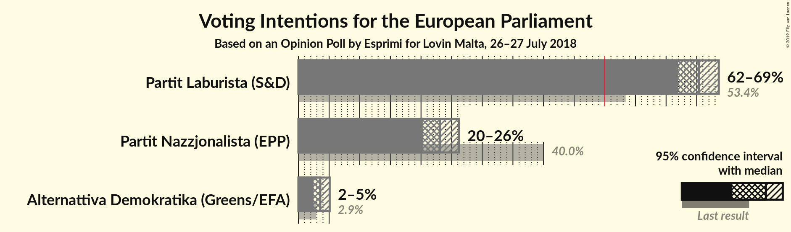
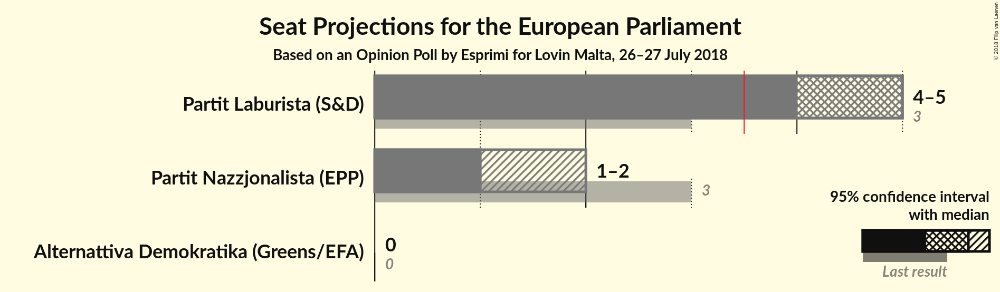
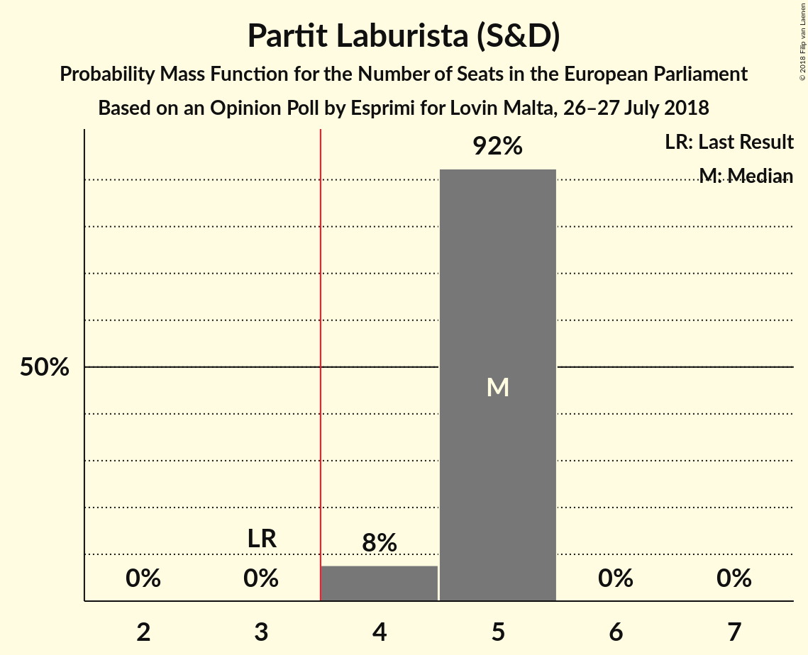
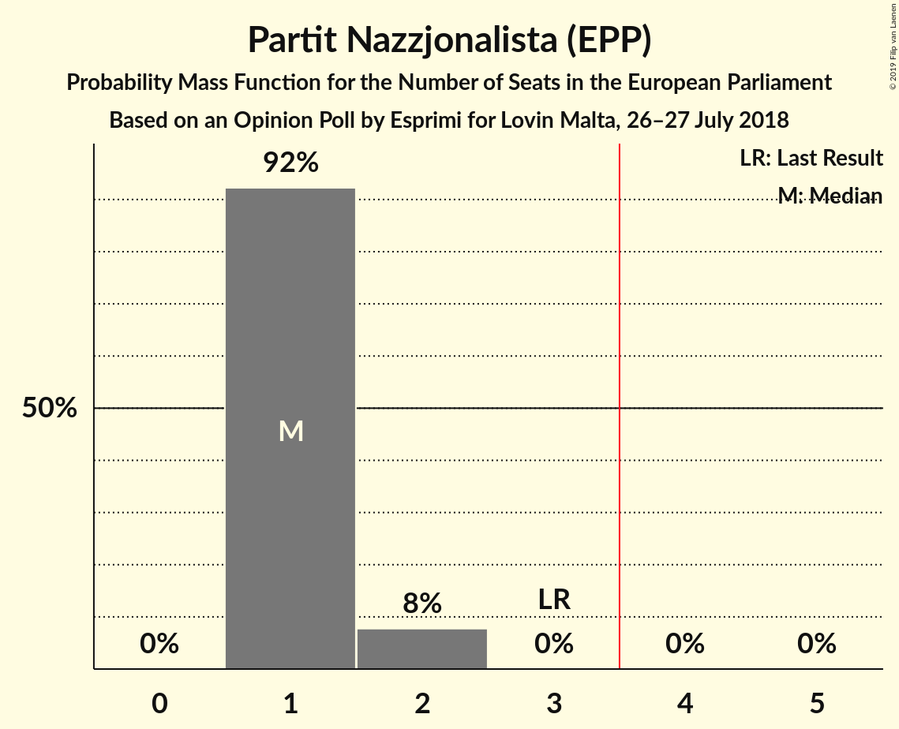
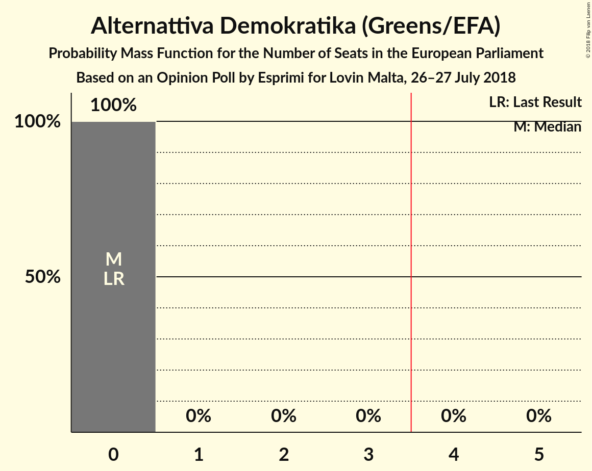
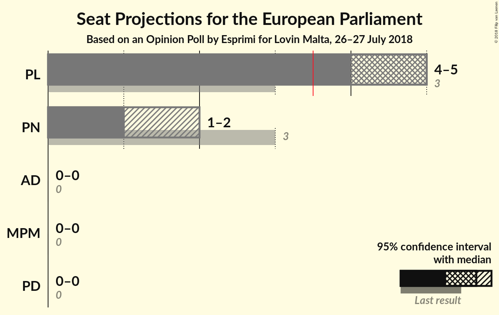
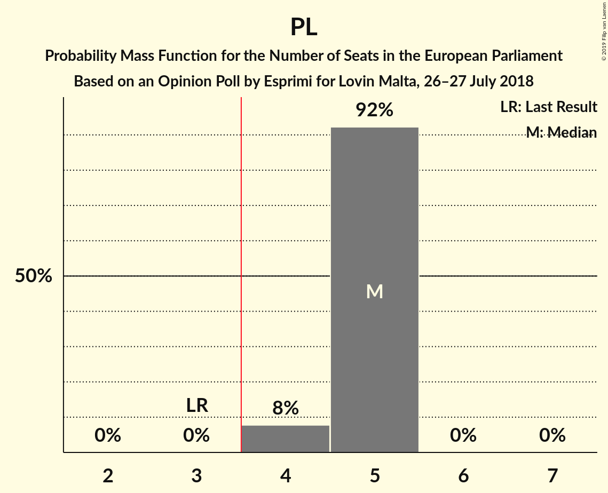
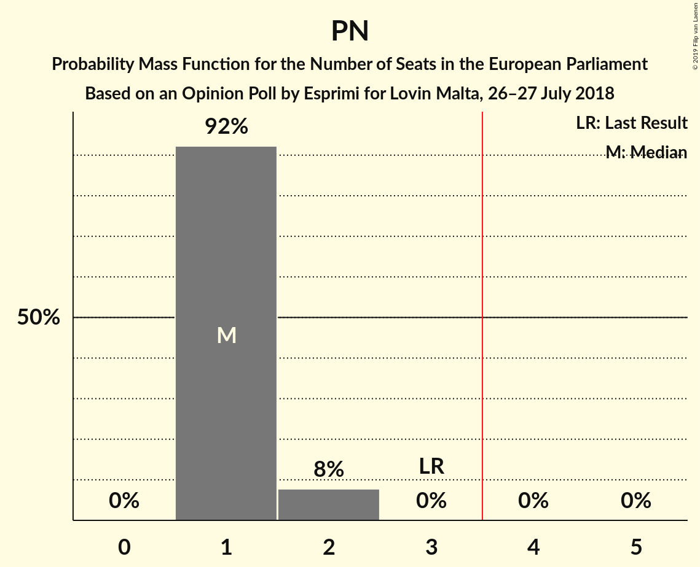
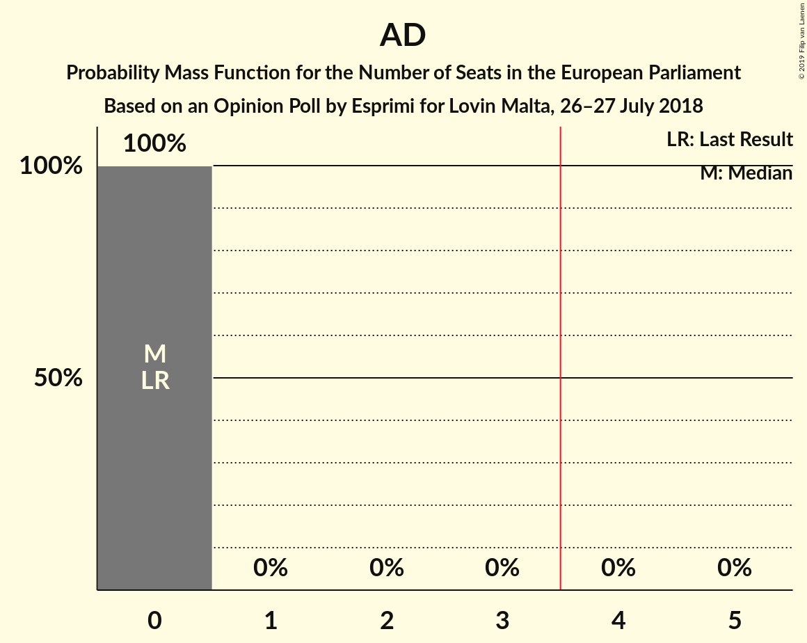

# Opinion Poll by Esprimi for Lovin Malta, 26–27 July 2018

<a href="#voting-intentions">Voting Intentions</a> | <a href="#seats">Seats</a> | <a href="#coalitions">Coalitions</a> | <a href="#technical-information">Technical Information</a>

## Voting Intentions

### Confidence Intervals

| Party | Last Result | Poll Result | 80% Confidence Interval | 90% Confidence Interval | 95% Confidence Interval | 99% Confidence Interval |
|:-----:|:-----------:|:-----------:|:-----------------------:|:-----------------------:|:-----------------------:|:-----------------------:|
| Partit Laburista (S&D) | 53.4% | 65.4% | 63.1–67.5% |62.5–68.1% |62.0–68.6% |60.9–69.6% |
| Partit Nazzjonalista (EPP) | 40.0% | 23.1% | 21.2–25.1% |20.7–25.7% |20.3–26.2% |19.4–27.1% |
| Alternattiva Demokratika (Greens/EFA) | 2.9% | 3.6% | 2.8–4.6% |2.6–4.8% |2.5–5.1% |2.2–5.6% |

*Note:* The poll result column reflects the actual value used in the calculations. Published results may vary slightly, and in addition be rounded to fewer digits.

## Seats

### Confidence Intervals

| Party | Last Result | Median | 80% Confidence Interval | 90% Confidence Interval | 95% Confidence Interval | 99% Confidence Interval |
|:-----:|:-----------:|:------:|:-----------------------:|:-----------------------:|:-----------------------:|:-----------------------:|
| <a href="#partit-laburista-(s&d)">Partit Laburista (S&D)</a> | 3 | 5 | 5 |4–5 |4–5 |4–5 |
| <a href="#partit-nazzjonalista-(epp)">Partit Nazzjonalista (EPP)</a> | 3 | 1 | 1 |1–2 |1–2 |1–2 |
| <a href="#alternattiva-demokratika-(greens/efa)">Alternattiva Demokratika (Greens/EFA)</a> | 0 | 0 | 0 |0 |0 |0 |

### Partit Laburista (S&D)

*For a full overview of the results for this party, see the [Partit Laburista (S&D)](party-partitlaburistasd.html) page.*

| Number of Seats | Probability | Accumulated | Special Marks |
|:---------------:|:-----------:|:-----------:|:-------------:|
| 3 | 0% | 100% | Last Result |
| 4 | 8% | 100% | Majority |
| 5 | 92% | 92% | Median |
| 6 | 0% | 0% |  |

### Partit Nazzjonalista (EPP)

*For a full overview of the results for this party, see the [Partit Nazzjonalista (EPP)](party-partitnazzjonalistaepp.html) page.*

| Number of Seats | Probability | Accumulated | Special Marks |
|:---------------:|:-----------:|:-----------:|:-------------:|
| 1 | 92% | 100% | Median |
| 2 | 8% | 8% |  |
| 3 | 0% | 0% | Last Result |

### Alternattiva Demokratika (Greens/EFA)

*For a full overview of the results for this party, see the [Alternattiva Demokratika (Greens/EFA)](party-alternattivademokratikagreensefa.html) page.*

| Number of Seats | Probability | Accumulated | Special Marks |
|:---------------:|:-----------:|:-----------:|:-------------:|
| 0 | 100% | 100% | Last Result, Median |

## Coalitions

### Confidence Intervals

| Coalition | Last Result | Median | Majority? | 80% Confidence Interval | 90% Confidence Interval | 95% Confidence Interval | 99% Confidence Interval |
|:---------:|:-----------:|:------:|:---------:|:-----------------------:|:-----------------------:|:-----------------------:|:-----------------------:|
| Partit Laburista (S&D) | 3 | 5 | 100% | 5 | 4–5 | 4–5 | 4–5 |
| Partit Nazzjonalista (EPP) | 3 | 1 | 0% | 1 | 1–2 | 1–2 | 1–2 |
| Alternattiva Demokratika (Greens/EFA) | 0 | 0 | 0% | 0 | 0 | 0 | 0 |

### Partit Laburista (S&D)

| Number of Seats | Probability | Accumulated | Special Marks |
|:---------------:|:-----------:|:-----------:|:-------------:|
| 3 | 0% | 100% | Last Result |
| 4 | 8% | 100% | Majority |
| 5 | 92% | 92% | Median |
| 6 | 0% | 0% |  |

### Partit Nazzjonalista (EPP)

| Number of Seats | Probability | Accumulated | Special Marks |
|:---------------:|:-----------:|:-----------:|:-------------:|
| 1 | 92% | 100% | Median |
| 2 | 8% | 8% |  |
| 3 | 0% | 0% | Last Result |

### Alternattiva Demokratika (Greens/EFA)

| Number of Seats | Probability | Accumulated | Special Marks |
|:---------------:|:-----------:|:-----------:|:-------------:|
| 0 | 100% | 100% | Last Result, Median |

## Technical Information

### Opinion Poll

+ **Polling firm:** Esprimi
+ **Commissioner(s):** Lovin Malta
+ **Fieldwork period:** 26–27 July 2018

### Calculations

+ **Sample size:** 788
+ **Simulations done:** 131,072
+ **Error estimate:** 0.61%

