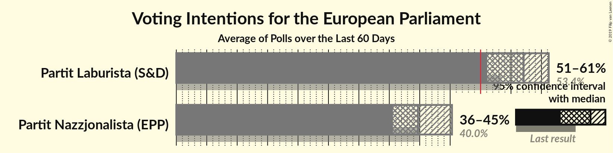
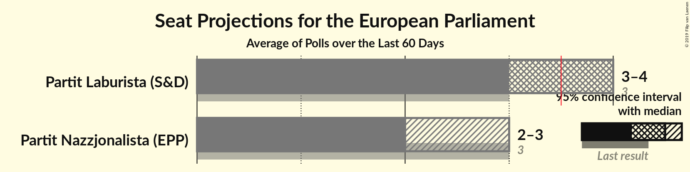
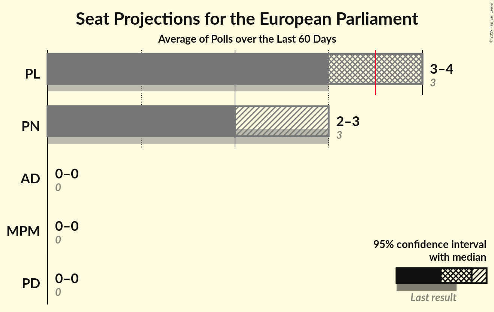

# Overview

The table below lists the most recent polls (less than 60 days old) registered and analyzed so far.

| Period     | Polling firm/Commissioner(s) | PL | PN | AD | PD | MPM |
|:----------:|:----------------------------:|:--:|:--:|:--:|:--:|:--:|
| 25 May 2014 | General Election | 53.4%   3 | 40.0%   3 | 2.9%   0 | 0.0%   0 | 0.0%   0 |
| N/A | [Poll Average](average.html) | 51–61%   3–4 | 36–45%   2–3 | N/A   N/A | N/A   N/A | N/A   N/A |
| [9–15 May 2019](2019-05-15-MaltaToday.html) | MaltaToday | 54–61%   3–4 | 36–42%   2–3 | N/A   N/A | N/A   N/A | N/A   N/A |
| [8–11 May 2019](2019-05-11-MISCO.html) | MISCO   Sunday Times | 50–61%   3–4 | 35–46%   2–3 | N/A   N/A | N/A   N/A | N/A   N/A |
| 25 May 2014 | General Election | 53.4%   3 | 40.0%   3 | 2.9%   0 | 0.0%   0 | 0.0%   0 |

Only polls for which at least the sample size has been published are included in the table above.

**Legend:**
+ **Top half of each row:** Voting intentions (95% confidence interval)
+ **Bottom half of each row:** Seat projections for the European Parliament (95% confidence interval)
+ **PL:** Partit Laburista (S&D)
+ **PN:** Partit Nazzjonalista (EPP)
+ **AD:** Alternattiva Demokratika (Greens/EFA)
+ **PD:** Partit Demokratiku (ALDE)
+ **MPM:** Moviment Patrijotti Maltin (EAPN)
+ **N/A (single party):** Party not included the published results
+ **N/A (entire row):** Calculation for this opinion poll not started yet

