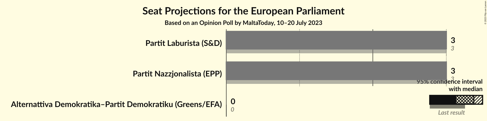
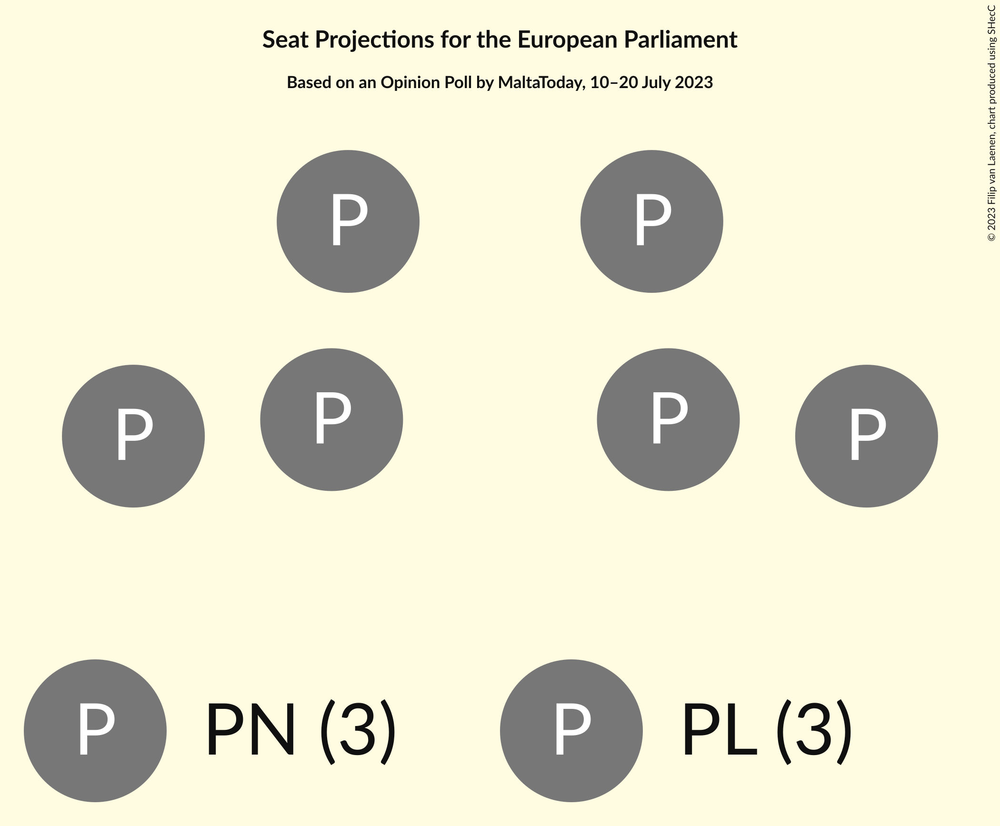
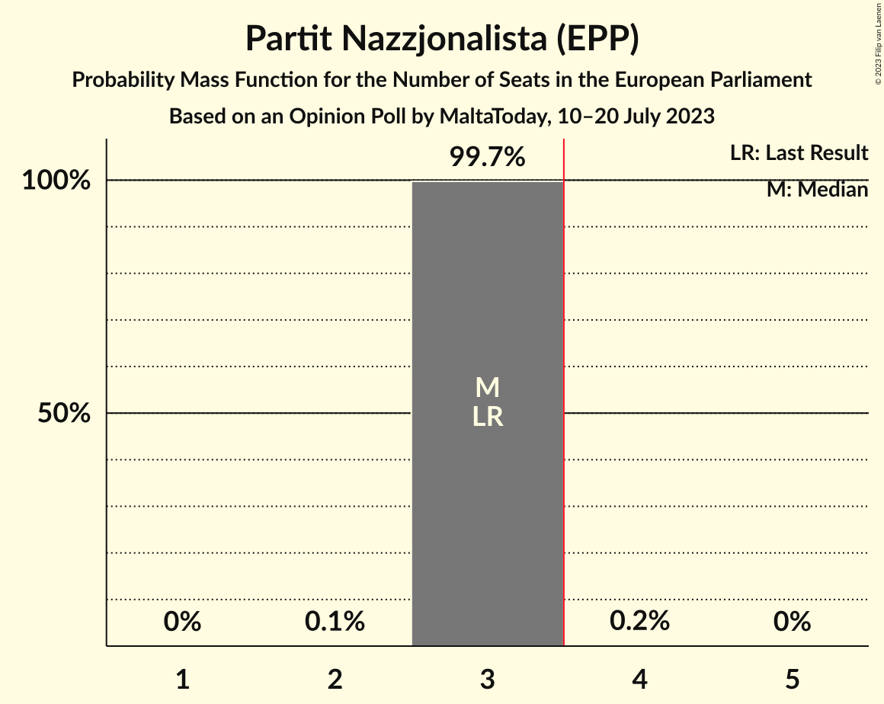
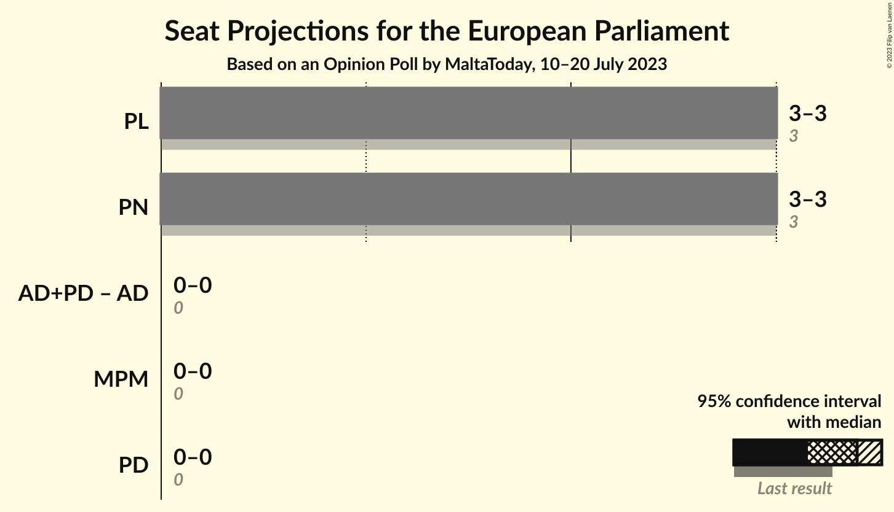
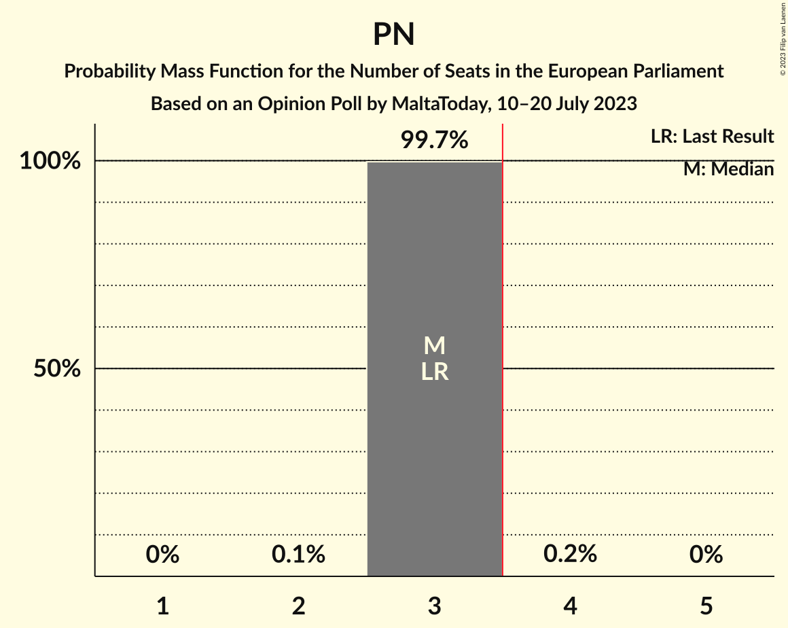

# Opinion Poll by MaltaToday, 10–20 July 2023

<a href="#voting-intentions">Voting Intentions</a> | <a href="#seats">Seats</a> | <a href="#coalitions">Coalitions</a> | <a href="#technical-information">Technical Information</a>

## Voting Intentions

### Confidence Intervals

| Party | Last Result | Poll Result | 80% Confidence Interval | 90% Confidence Interval | 95% Confidence Interval | 99% Confidence Interval |
|:-----:|:-----------:|:-----------:|:-----------------------:|:-----------------------:|:-----------------------:|:-----------------------:|
| Partit Nazzjonalista (EPP) | 40.0% | 48.5% | 45.6–51.5% |44.7–52.3% |44.0–53.0% |42.6–54.4% |
| Partit Laburista (S&D) | 53.4% | 47.7% | 44.7–50.6% |43.9–51.5% |43.2–52.2% |41.8–53.6% |
| Alternattiva Demokratika–Partit Demokratiku (Greens/EFA) | 0.0% | 1.9% | 1.3–3.0% |1.1–3.3% |1.0–3.6% |0.8–4.2% |

*Note:* The poll result column reflects the actual value used in the calculations. Published results may vary slightly, and in addition be rounded to fewer digits.

## Seats

### Confidence Intervals

| Party | Last Result | Median | 80% Confidence Interval | 90% Confidence Interval | 95% Confidence Interval | 99% Confidence Interval |
|:-----:|:-----------:|:------:|:-----------------------:|:-----------------------:|:-----------------------:|:-----------------------:|
| <a href="#partit-nazzjonalista-(epp)">Partit Nazzjonalista (EPP)</a> | 3 | 3 | 3 |3 |3 |3 |
| <a href="#partit-laburista-(s&d)">Partit Laburista (S&D)</a> | 3 | 3 | 3 |3 |3 |3 |
| <a href="#alternattiva-demokratika–partit-demokratiku-(greens/efa)">Alternattiva Demokratika–Partit Demokratiku (Greens/EFA)</a> | 0 | 0 | 0 |0 |0 |0 |

### Partit Nazzjonalista (EPP)

*For a full overview of the results for this party, see the [Partit Nazzjonalista (EPP)](party-partitnazzjonalistaepp.html) page.*

| Number of Seats | Probability | Accumulated | Special Marks |
|:---------------:|:-----------:|:-----------:|:-------------:|
| 2 | 0.1% | 100% |  |
| 3 | 99.7% | 99.9% | Last Result, Median |
| 4 | 0.2% | 0.2% | Majority |
| 5 | 0% | 0% |  |

### Partit Laburista (S&D)

*For a full overview of the results for this party, see the [Partit Laburista (S&D)](party-partitlaburistasd.html) page.*

| Number of Seats | Probability | Accumulated | Special Marks |
|:---------------:|:-----------:|:-----------:|:-------------:|
| 2 | 0.2% | 100% |  |
| 3 | 99.7% | 99.8% | Last Result, Median |
| 4 | 0.1% | 0.1% | Majority |
| 5 | 0% | 0% |  |

### Alternattiva Demokratika–Partit Demokratiku (Greens/EFA)

*For a full overview of the results for this party, see the [Alternattiva Demokratika–Partit Demokratiku (Greens/EFA)](party-alternattivademokratika–partitdemokratikugreensefa.html) page.*

| Number of Seats | Probability | Accumulated | Special Marks |
|:---------------:|:-----------:|:-----------:|:-------------:|
| 0 | 100% | 100% | Last Result, Median |

## Coalitions

### Confidence Intervals

| Coalition | Last Result | Median | Majority? | 80% Confidence Interval | 90% Confidence Interval | 95% Confidence Interval | 99% Confidence Interval |
|:---------:|:-----------:|:------:|:---------:|:-----------------------:|:-----------------------:|:-----------------------:|:-----------------------:|
| Partit Laburista (S&D) | 3 | 3 | 0.1% | 3 | 3 | 3 | 3 |
| Partit Nazzjonalista (EPP) | 3 | 3 | 0.2% | 3 | 3 | 3 | 3 |

### Partit Laburista (S&D)

| Number of Seats | Probability | Accumulated | Special Marks |
|:---------------:|:-----------:|:-----------:|:-------------:|
| 2 | 0.2% | 100% |  |
| 3 | 99.7% | 99.8% | Last Result, Median |
| 4 | 0.1% | 0.1% | Majority |
| 5 | 0% | 0% |  |

### Partit Nazzjonalista (EPP)

| Number of Seats | Probability | Accumulated | Special Marks |
|:---------------:|:-----------:|:-----------:|:-------------:|
| 2 | 0.1% | 100% |  |
| 3 | 99.7% | 99.9% | Last Result, Median |
| 4 | 0.2% | 0.2% | Majority |
| 5 | 0% | 0% |  |

## Technical Information

### Opinion Poll

+ **Polling firm:** MaltaToday
+ **Commissioner(s):** —
+ **Fieldwork period:** 10–20 July 2023

### Calculations

+ **Sample size:** 472
+ **Simulations done:** 1,048,576
+ **Error estimate:** 0.12%

