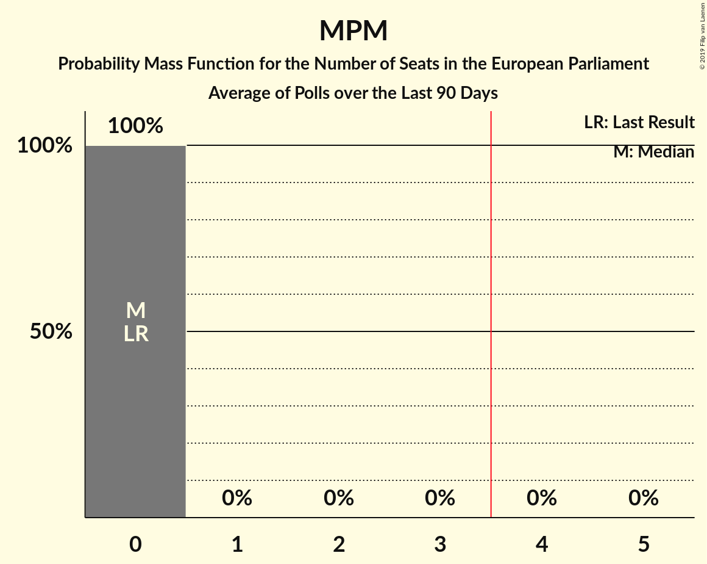

# Poll Average

<a href="#voting-intentions">Voting Intentions</a> | <a href="#seats">Seats</a> | <a href="#coalitions">Coalitions</a> | <a href="#technical-information">Technical Information</a>

## Summary

The table below lists the polls on which the average is based. They are the most recent polls (less than 90 days old) registered and analyzed so far.

| Period     | Polling firm/Commissioner(s) | PL | PN | AD | PD | MPM |
|:----------:|:----------------------------:|:--:|:--:|:--:|:--:|:--:|
| 25 May 2019 | General Election | 53.4%   3 | 40.0%   3 | 2.9%   0 | 0.0%   0 | 0.0%   0 |
| N/A | Poll Average | 55–63%   3–4 | 36–44%   2–3 | 0–2%   0 | N/A   N/A | N/A   N/A |
| [16–20 September 2019](2019-09-20-Sagalytics.html) | Sagalytics | 55–63%   3–4 | 36–44%   2–3 | 1–2%   0 | N/A   N/A | N/A   N/A |
| 25 May 2019 | General Election | 53.4%   3 | 40.0%   3 | 2.9%   0 | 0.0%   0 | 0.0%   0 |

Only polls for which at least the sample size has been published are included in the table above.

**Legend:**
+ **Top half of each row:** Voting intentions (95% confidence interval)
+ **Bottom half of each row:** Seat projections for the European Parliament (95% confidence interval)
+ **PL:** Partit Laburista (S&D)
+ **PN:** Partit Nazzjonalista (EPP)
+ **AD:** Alternattiva Demokratika (Greens/EFA)
+ **PD:** Partit Demokratiku (RE)
+ **MPM:** Moviment Patrijotti Maltin (ID)
+ **N/A (single party):** Party not included the published results
+ **N/A (entire row):** Calculation for this opinion poll not started yet

## Voting Intentions

### Confidence Intervals

| Party | Last Result | Median | 80% Confidence Interval | 90% Confidence Interval | 95% Confidence Interval | 99% Confidence Interval |
|:-----:|:-----------:|:------:|:-----------------------:|:-----------------------:|:-----------------------:|:-----------------------:|
| <a href="#partit-laburista-(s&d)">Partit Laburista (S&D)</a> | 53.4% | 59.1% | 56.6–61.5% |55.9–62.2% | 55.3–62.8% | 54.1–63.9% |
| <a href="#partit-nazzjonalista-(epp)">Partit Nazzjonalista (EPP)</a> | 40.0% | 39.9% | 37.5–42.3% |36.8–43.0% | 36.2–43.6% | 35.0–44.8% |
| <a href="#alternattiva-demokratika-(greens/efa)">Alternattiva Demokratika (Greens/EFA)</a> | 2.9% | 1.2% | 0.7–1.8% |0.6–2.0% | 0.5–2.2% | 0.4–2.6% |
| <a href="#partit-demokratiku-(re)">Partit Demokratiku (RE)</a> | 0.0% | N/A | N/A |N/A | N/A | N/A |
| <a href="#moviment-patrijotti-maltin-(id)">Moviment Patrijotti Maltin (ID)</a> | 0.0% | N/A | N/A |N/A | N/A | N/A |

### Partit Laburista (S&D)

*For a full overview of the results for this party, see the [Partit Laburista (S&D)](party-partitlaburistasd.html) page.*

| Voting Intentions | Probability | Accumulated | Special Marks |
|:-----------------:|:-----------:|:-----------:|:-------------:|
| 51.5–52.5% | 0% | 100% |  |
| 52.5–53.5% | 0.2% | 100% | Last Result |
| 53.5–54.5% | 0.7% | 99.8% |  |
| 54.5–55.5% | 2% | 99.1% |  |
| 55.5–56.5% | 6% | 97% |  |
| 56.5–57.5% | 12% | 91% |  |
| 57.5–58.5% | 18% | 79% |  |
| 58.5–59.5% | 21% | 61% | Median |
| 59.5–60.5% | 18% | 40% |  |
| 60.5–61.5% | 12% | 22% |  |
| 61.5–62.5% | 6% | 10% |  |
| 62.5–63.5% | 2% | 3% |  |
| 63.5–64.5% | 0.7% | 0.9% |  |
| 64.5–65.5% | 0.2% | 0.2% |  |
| 65.5–66.5% | 0% | 0% |  |

### Partit Nazzjonalista (EPP)

*For a full overview of the results for this party, see the [Partit Nazzjonalista (EPP)](party-partitnazzjonalistaepp.html) page.*

| Voting Intentions | Probability | Accumulated | Special Marks |
|:-----------------:|:-----------:|:-----------:|:-------------:|
| 32.5–33.5% | 0% | 100% |  |
| 33.5–34.5% | 0.2% | 100% |  |
| 34.5–35.5% | 0.8% | 99.8% |  |
| 35.5–36.5% | 3% | 99.0% |  |
| 36.5–37.5% | 7% | 96% |  |
| 37.5–38.5% | 13% | 89% |  |
| 38.5–39.5% | 19% | 76% |  |
| 39.5–40.5% | 20% | 57% | Last Result, Median |
| 40.5–41.5% | 17% | 36% |  |
| 41.5–42.5% | 11% | 19% |  |
| 42.5–43.5% | 5% | 8% |  |
| 43.5–44.5% | 2% | 3% |  |
| 44.5–45.5% | 0.6% | 0.7% |  |
| 45.5–46.5% | 0.1% | 0.2% |  |
| 46.5–47.5% | 0% | 0% |  |

### Alternattiva Demokratika (Greens/EFA)

*For a full overview of the results for this party, see the [Alternattiva Demokratika (Greens/EFA)](party-alternattivademokratikagreensefa.html) page.*

| Voting Intentions | Probability | Accumulated | Special Marks |
|:-----------------:|:-----------:|:-----------:|:-------------:|
| 0.0–0.5% | 3% | 100% |  |
| 0.5–1.5% | 77% | 97% | Median |
| 1.5–2.5% | 19% | 19% |  |
| 2.5–3.5% | 0.5% | 0.6% | Last Result |
| 3.5–4.5% | 0% | 0% |  |

## Seats

### Confidence Intervals

| Party | Last Result | Median | 80% Confidence Interval | 90% Confidence Interval | 95% Confidence Interval | 99% Confidence Interval |
|:-----:|:-----------:|:------:|:-----------------------:|:-----------------------:|:-----------------------:|:-----------------------:|
| <a href="#partit-laburista-(s&d)">Partit Laburista (S&D)</a> | 3 | 4 | 4 |3–4 | 3–4 | 3–4 |
| <a href="#partit-nazzjonalista-(epp)">Partit Nazzjonalista (EPP)</a> | 3 | 2 | 2 |2–3 | 2–3 | 2–3 |
| <a href="#alternattiva-demokratika-(greens/efa)">Alternattiva Demokratika (Greens/EFA)</a> | 0 | 0 | 0 |0 | 0 | 0 |
| <a href="#partit-demokratiku-(re)">Partit Demokratiku (RE)</a> | 0 | N/A | N/A |N/A | N/A | N/A |
| <a href="#moviment-patrijotti-maltin-(id)">Moviment Patrijotti Maltin (ID)</a> | 0 | N/A | N/A |N/A | N/A | N/A |

### Partit Laburista (S&D)

*For a full overview of the results for this party, see the [Partit Laburista (S&D)](party-partitlaburistasd.html) page.*

| Number of Seats | Probability | Accumulated | Special Marks |
|:---------------:|:-----------:|:-----------:|:-------------:|
| 3 | 9% | 100% | Last Result |
| 4 | 91% | 91% | Median, Majority |
| 5 | 0% | 0% |  |

### Partit Nazzjonalista (EPP)

*For a full overview of the results for this party, see the [Partit Nazzjonalista (EPP)](party-partitnazzjonalistaepp.html) page.*

| Number of Seats | Probability | Accumulated | Special Marks |
|:---------------:|:-----------:|:-----------:|:-------------:|
| 2 | 91% | 100% | Median |
| 3 | 9% | 9% | Last Result |
| 4 | 0% | 0% | Majority |

### Alternattiva Demokratika (Greens/EFA)

*For a full overview of the results for this party, see the [Alternattiva Demokratika (Greens/EFA)](party-alternattivademokratikagreensefa.html) page.*

| Number of Seats | Probability | Accumulated | Special Marks |
|:---------------:|:-----------:|:-----------:|:-------------:|
| 0 | 100% | 100% | Last Result, Median |

## Coalitions

### Confidence Intervals

| Coalition | Last Result | Median | Majority? | 80% Confidence Interval | 90% Confidence Interval | 95% Confidence Interval | 99% Confidence Interval |
|:---------:|:-----------:|:------:|:---------:|:-----------------------:|:-----------------------:|:-----------------------:|:-----------------------:|
| Partit Laburista (S&D) | 3 | 4 | 91% | 4 | 3–4 | 3–4 | 3–4 |
| Partit Nazzjonalista (EPP) | 3 | 2 | 0% | 2 | 2–3 | 2–3 | 2–3 |
| Alternattiva Demokratika (Greens/EFA) | 0 | 0 | 0% | 0 | 0 | 0 | 0 |
| Moviment Patrijotti Maltin (ID) | 0 | 0 | 0% | 0 | 0 | 0 | 0 |
| Partit Demokratiku (RE) | 0 | 0 | 0% | 0 | 0 | 0 | 0 |

### Partit Laburista (S&D)

| Number of Seats | Probability | Accumulated | Special Marks |
|:---------------:|:-----------:|:-----------:|:-------------:|
| 3 | 9% | 100% | Last Result |
| 4 | 91% | 91% | Median, Majority |
| 5 | 0% | 0% |  |

### Partit Nazzjonalista (EPP)

| Number of Seats | Probability | Accumulated | Special Marks |
|:---------------:|:-----------:|:-----------:|:-------------:|
| 2 | 91% | 100% | Median |
| 3 | 9% | 9% | Last Result |
| 4 | 0% | 0% | Majority |

### Alternattiva Demokratika (Greens/EFA)

| Number of Seats | Probability | Accumulated | Special Marks |
|:---------------:|:-----------:|:-----------:|:-------------:|
| 0 | 100% | 100% | Last Result, Median |

### Moviment Patrijotti Maltin (ID)

| Number of Seats | Probability | Accumulated | Special Marks |
|:---------------:|:-----------:|:-----------:|:-------------:|
| 0 | 100% | 100% | Last Result, Median |

### Partit Demokratiku (RE)

| Number of Seats | Probability | Accumulated | Special Marks |
|:---------------:|:-----------:|:-----------:|:-------------:|
| 0 | 100% | 100% | Last Result, Median |

## Technical Information

+ **Number of polls included in this average:** 1
+ **Lowest number of simulations done in a poll included in this average:** 1,048,576
+ **Total number of simulations done in the polls included in this average:** 1,048,576
+ **Error estimate:** 0.40%
