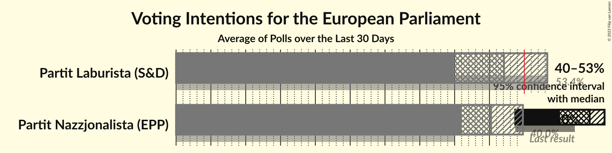
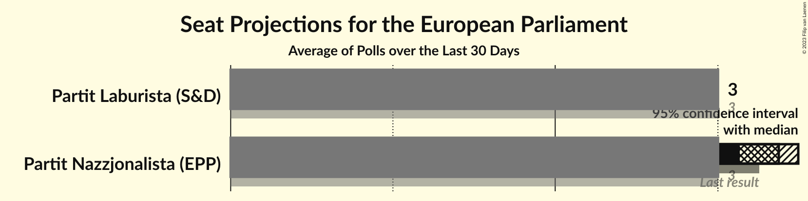
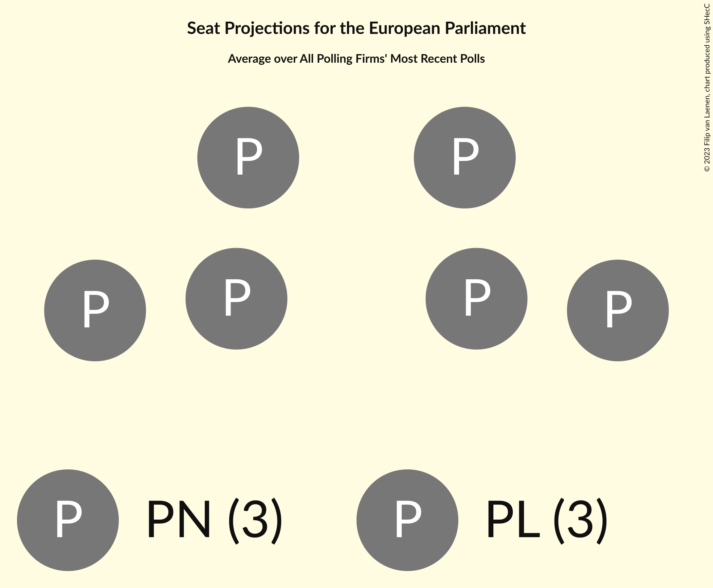
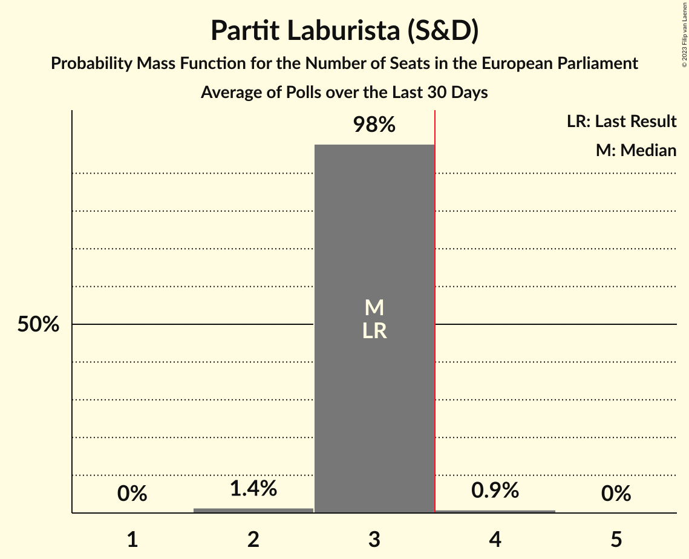
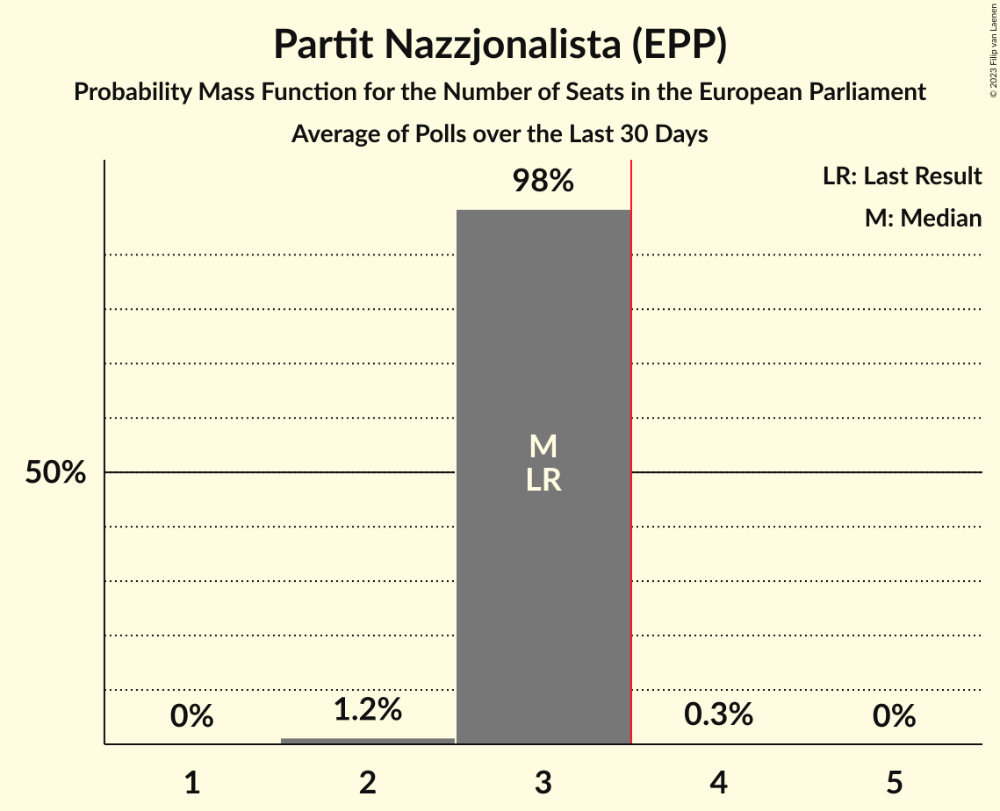
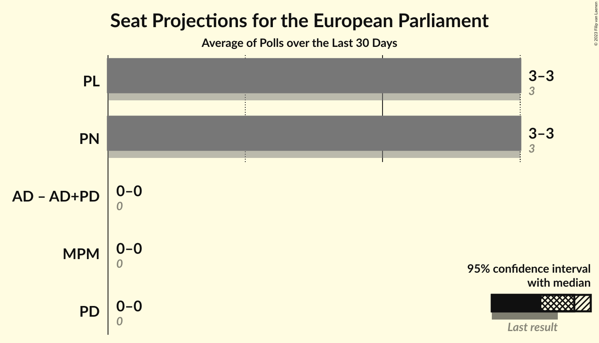
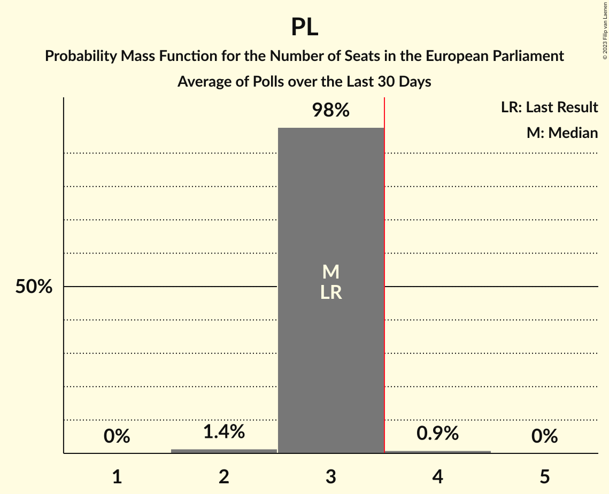
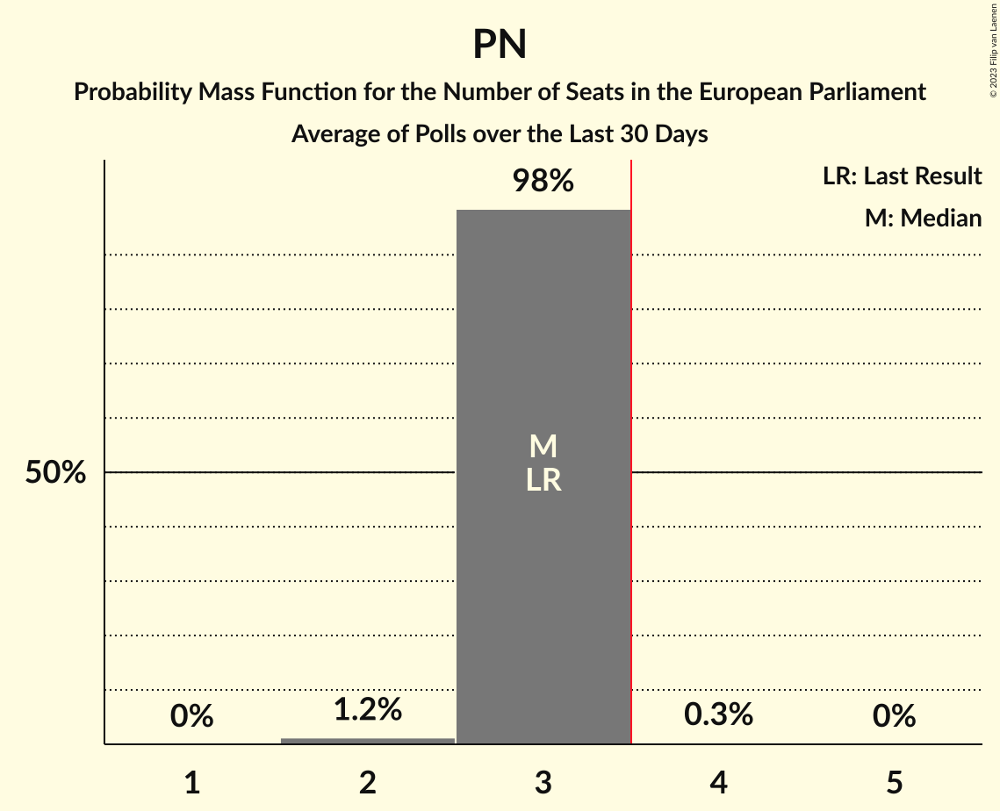
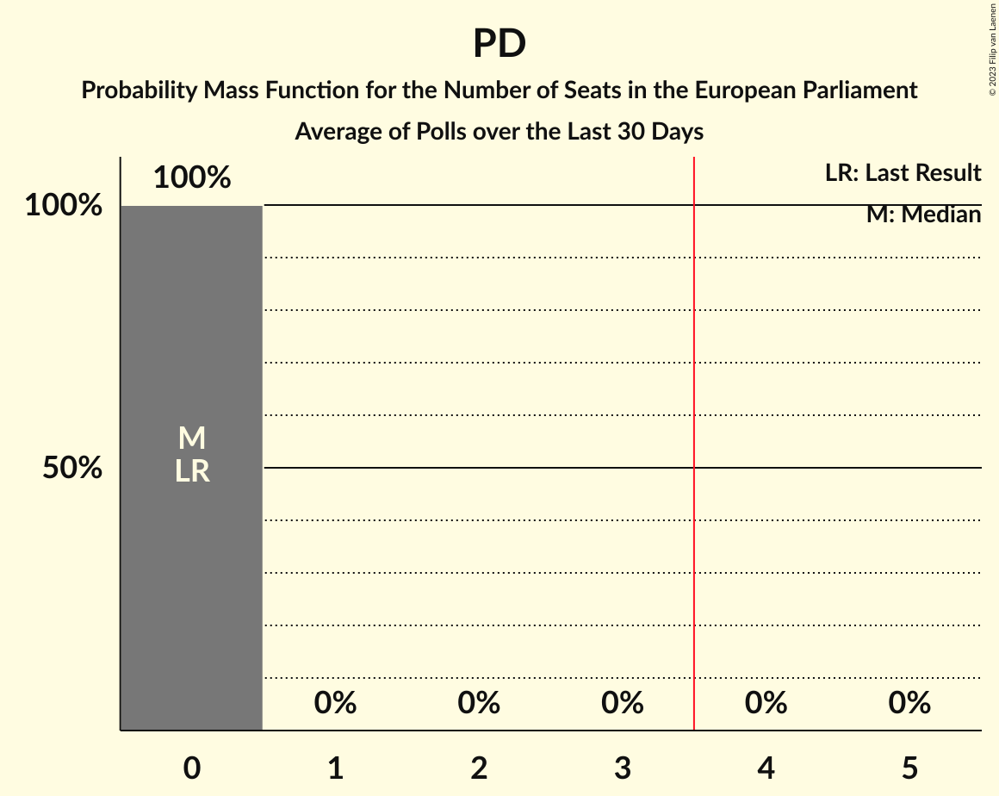

# Poll Average

<a href="#voting-intentions">Voting Intentions</a> | <a href="#seats">Seats</a> | <a href="#coalitions">Coalitions</a> | <a href="#technical-information">Technical Information</a>

## Summary

The table below lists the polls on which the average is based. They are the most recent polls (less than 30 days old) registered and analyzed so far.

| Period     | Polling firm/Commissioner(s) | PL | PN | AD | PD | MPM | AD+PD |
|:----------:|:----------------------------:|:--:|:--:|:--:|:--:|:--:|:--:|
| 25 May 2019 | General Election | 53.4%   3 | 40.0%   3 | 2.9%   0 | 0.0%   0 | 0.0%   0 | 0.0%   0 |
| N/A | Poll Average | 40–53%   3 | 41–50%   3 | N/A   N/A | N/A   N/A | N/A   N/A | N/A   N/A |
| [14–26 October 2023](2023-10-26-Esprimi.html) | Esprimi   Times of Malta | 46–54%   3 | 41–49%   3 | N/A   N/A | N/A   N/A | N/A   N/A | N/A   N/A |
| [25 September–4 October 2023](2023-10-04-MaltaToday.html) | MaltaToday | 39–48%   2–3 | 41–50%   3 | N/A   N/A | N/A   N/A | N/A   N/A | N/A   N/A |
| 25 May 2019 | General Election | 53.4%   3 | 40.0%   3 | 2.9%   0 | 0.0%   0 | 0.0%   0 | 0.0%   0 |

Only polls for which at least the sample size has been published are included in the table above.

**Legend:**
+ **Top half of each row:** Voting intentions (95% confidence interval)
+ **Bottom half of each row:** Seat projections for the European Parliament (95% confidence interval)
+ **PL:** Partit Laburista (S&D)
+ **PN:** Partit Nazzjonalista (EPP)
+ **AD:** Alternattiva Demokratika (Greens/EFA)
+ **PD:** Partit Demokratiku (RE)
+ **MPM:** Moviment Patrijotti Maltin (ID)
+ **AD+PD:** Alternattiva Demokratika–Partit Demokratiku (Greens/EFA)
+ **N/A (single party):** Party not included the published results
+ **N/A (entire row):** Calculation for this opinion poll not started yet

## Voting Intentions

### Confidence Intervals

| Party | Last Result | Median | 80% Confidence Interval | 90% Confidence Interval | 95% Confidence Interval | 99% Confidence Interval |
|:-----:|:-----------:|:------:|:-----------------------:|:-----------------------:|:-----------------------:|:-----------------------:|
| <a href="#partit-laburista-(s&d)">Partit Laburista (S&D)</a> | 53.4% | 47.1% | 41.8–51.7% |40.8–52.6% | 39.9–53.3% | 38.4–54.7% |
| <a href="#partit-nazzjonalista-(epp)">Partit Nazzjonalista (EPP)</a> | 40.0% | 45.2% | 42.5–48.2% |41.7–49.0% | 41.0–49.8% | 39.7–51.2% |
| <a href="#alternattiva-demokratika-(greens/efa)">Alternattiva Demokratika (Greens/EFA)</a> | 2.9% | N/A | N/A |N/A | N/A | N/A |
| <a href="#partit-demokratiku-(re)">Partit Demokratiku (RE)</a> | 0.0% | N/A | N/A |N/A | N/A | N/A |
| <a href="#moviment-patrijotti-maltin-(id)">Moviment Patrijotti Maltin (ID)</a> | 0.0% | N/A | N/A |N/A | N/A | N/A |
| <a href="#alternattiva-demokratika–partit-demokratiku-(greens/efa)">Alternattiva Demokratika–Partit Demokratiku (Greens/EFA)</a> | 0.0% | N/A | N/A |N/A | N/A | N/A |

### Partit Laburista (S&D)

*For a full overview of the results for this party, see the [Partit Laburista (S&D)](party-partitlaburistasd.html) page.*

| Voting Intentions | Probability | Accumulated | Special Marks |
|:-----------------:|:-----------:|:-----------:|:-------------:|
| 35.5–36.5% | 0% | 100% |  |
| 36.5–37.5% | 0.1% | 100% |  |
| 37.5–38.5% | 0.4% | 99.8% |  |
| 38.5–39.5% | 1.1% | 99.4% |  |
| 39.5–40.5% | 2% | 98% |  |
| 40.5–41.5% | 4% | 96% |  |
| 41.5–42.5% | 7% | 91% |  |
| 42.5–43.5% | 8% | 85% |  |
| 43.5–44.5% | 9% | 76% |  |
| 44.5–45.5% | 8% | 68% |  |
| 45.5–46.5% | 7% | 60% |  |
| 46.5–47.5% | 7% | 53% | Median |
| 47.5–48.5% | 8% | 47% |  |
| 48.5–49.5% | 9% | 39% |  |
| 49.5–50.5% | 10% | 30% |  |
| 50.5–51.5% | 9% | 20% |  |
| 51.5–52.5% | 6% | 11% |  |
| 52.5–53.5% | 3% | 5% | Last Result |
| 53.5–54.5% | 1.4% | 2% |  |
| 54.5–55.5% | 0.5% | 0.6% |  |
| 55.5–56.5% | 0.1% | 0.2% |  |
| 56.5–57.5% | 0% | 0% |  |

### Partit Nazzjonalista (EPP)

*For a full overview of the results for this party, see the [Partit Nazzjonalista (EPP)](party-partitnazzjonalistaepp.html) page.*

| Voting Intentions | Probability | Accumulated | Special Marks |
|:-----------------:|:-----------:|:-----------:|:-------------:|
| 36.5–37.5% | 0% | 100% |  |
| 37.5–38.5% | 0.1% | 100% |  |
| 38.5–39.5% | 0.3% | 99.9% |  |
| 39.5–40.5% | 1.1% | 99.6% | Last Result |
| 40.5–41.5% | 3% | 98.5% |  |
| 41.5–42.5% | 6% | 96% |  |
| 42.5–43.5% | 11% | 89% |  |
| 43.5–44.5% | 16% | 78% |  |
| 44.5–45.5% | 18% | 62% | Median |
| 45.5–46.5% | 16% | 45% |  |
| 46.5–47.5% | 13% | 28% |  |
| 47.5–48.5% | 8% | 15% |  |
| 48.5–49.5% | 4% | 7% |  |
| 49.5–50.5% | 2% | 3% |  |
| 50.5–51.5% | 0.8% | 1.1% |  |
| 51.5–52.5% | 0.2% | 0.3% |  |
| 52.5–53.5% | 0.1% | 0.1% |  |
| 53.5–54.5% | 0% | 0% |  |

## Seats

### Confidence Intervals

| Party | Last Result | Median | 80% Confidence Interval | 90% Confidence Interval | 95% Confidence Interval | 99% Confidence Interval |
|:-----:|:-----------:|:------:|:-----------------------:|:-----------------------:|:-----------------------:|:-----------------------:|
| <a href="#partit-laburista-(s&d)">Partit Laburista (S&D)</a> | 3 | 3 | 3 |3 | 3 | 2–4 |
| <a href="#partit-nazzjonalista-(epp)">Partit Nazzjonalista (EPP)</a> | 3 | 3 | 3 |3 | 3 | 2–3 |
| <a href="#alternattiva-demokratika-(greens/efa)">Alternattiva Demokratika (Greens/EFA)</a> | 0 | N/A | N/A |N/A | N/A | N/A |
| <a href="#partit-demokratiku-(re)">Partit Demokratiku (RE)</a> | 0 | N/A | N/A |N/A | N/A | N/A |
| <a href="#moviment-patrijotti-maltin-(id)">Moviment Patrijotti Maltin (ID)</a> | 0 | N/A | N/A |N/A | N/A | N/A |
| <a href="#alternattiva-demokratika–partit-demokratiku-(greens/efa)">Alternattiva Demokratika–Partit Demokratiku (Greens/EFA)</a> | 0 | N/A | N/A |N/A | N/A | N/A |

### Partit Laburista (S&D)

*For a full overview of the results for this party, see the [Partit Laburista (S&D)](party-partitlaburistasd.html) page.*

| Number of Seats | Probability | Accumulated | Special Marks |
|:---------------:|:-----------:|:-----------:|:-------------:|
| 2 | 1.4% | 100% |  |
| 3 | 98% | 98.6% | Last Result, Median |
| 4 | 0.9% | 0.9% | Majority |
| 5 | 0% | 0% |  |

### Partit Nazzjonalista (EPP)

*For a full overview of the results for this party, see the [Partit Nazzjonalista (EPP)](party-partitnazzjonalistaepp.html) page.*

| Number of Seats | Probability | Accumulated | Special Marks |
|:---------------:|:-----------:|:-----------:|:-------------:|
| 2 | 1.2% | 100% |  |
| 3 | 98% | 98.8% | Last Result, Median |
| 4 | 0.3% | 0.3% | Majority |
| 5 | 0% | 0% |  |

### Alternattiva Demokratika (Greens/EFA)

*For a full overview of the results for this party, see the [Alternattiva Demokratika (Greens/EFA)](party-alternattivademokratikagreensefa.html) page.*

### Partit Demokratiku (RE)

*For a full overview of the results for this party, see the [Partit Demokratiku (RE)](party-partitdemokratikure.html) page.*

### Moviment Patrijotti Maltin (ID)

*For a full overview of the results for this party, see the [Moviment Patrijotti Maltin (ID)](party-movimentpatrijottimaltinid.html) page.*

### Alternattiva Demokratika–Partit Demokratiku (Greens/EFA)

*For a full overview of the results for this party, see the [Alternattiva Demokratika–Partit Demokratiku (Greens/EFA)](party-alternattivademokratika–partitdemokratikugreensefa.html) page.*

## Coalitions

### Confidence Intervals

| Coalition | Last Result | Median | Majority? | 80% Confidence Interval | 90% Confidence Interval | 95% Confidence Interval | 99% Confidence Interval |
|:---------:|:-----------:|:------:|:---------:|:-----------------------:|:-----------------------:|:-----------------------:|:-----------------------:|
| Partit Laburista (S&D) | 3 | 3 | 0.9% | 3 | 3 | 3 | 2–4 |
| Partit Nazzjonalista (EPP) | 3 | 3 | 0.3% | 3 | 3 | 3 | 2–3 |
| Alternattiva Demokratika (Greens/EFA) – Alternattiva Demokratika–Partit Demokratiku (Greens/EFA) | 0 | 0 | 0% | 0 | 0 | 0 | 0 |
| Moviment Patrijotti Maltin (ID) | 0 | 0 | 0% | 0 | 0 | 0 | 0 |
| Partit Demokratiku (RE) | 0 | 0 | 0% | 0 | 0 | 0 | 0 |

### Partit Laburista (S&D)

| Number of Seats | Probability | Accumulated | Special Marks |
|:---------------:|:-----------:|:-----------:|:-------------:|
| 2 | 1.4% | 100% |  |
| 3 | 98% | 98.6% | Last Result, Median |
| 4 | 0.9% | 0.9% | Majority |
| 5 | 0% | 0% |  |

### Partit Nazzjonalista (EPP)

| Number of Seats | Probability | Accumulated | Special Marks |
|:---------------:|:-----------:|:-----------:|:-------------:|
| 2 | 1.2% | 100% |  |
| 3 | 98% | 98.8% | Last Result, Median |
| 4 | 0.3% | 0.3% | Majority |
| 5 | 0% | 0% |  |

### Alternattiva Demokratika (Greens/EFA) – Alternattiva Demokratika–Partit Demokratiku (Greens/EFA)

| Number of Seats | Probability | Accumulated | Special Marks |
|:---------------:|:-----------:|:-----------:|:-------------:|
| 0 | 100% | 100% | Last Result, Median |

### Moviment Patrijotti Maltin (ID)

| Number of Seats | Probability | Accumulated | Special Marks |
|:---------------:|:-----------:|:-----------:|:-------------:|
| 0 | 100% | 100% | Last Result, Median |

### Partit Demokratiku (RE)

| Number of Seats | Probability | Accumulated | Special Marks |
|:---------------:|:-----------:|:-----------:|:-------------:|
| 0 | 100% | 100% | Last Result, Median |

## Technical Information

+ **Number of polls included in this average:** 2
+ **Lowest number of simulations done in a poll included in this average:** 1,048,576
+ **Total number of simulations done in the polls included in this average:** 2,097,152
+ **Error estimate:** 0.19%
