# Poll Average

<a href="#voting-intentions">Voting Intentions</a> | <a href="#seats">Seats</a> | <a href="#coalitions">Coalitions</a> | <a href="#technical-information">Technical Information</a>

## Summary

The table below lists the polls on which the average is based. They are the most recent polls (less than 90 days old) registered and analyzed so far.

| Period     | Polling firm/Commissioner(s) | PL | PN | AD | PD | MPM |
|:----------:|:----------------------------:|:--:|:--:|:--:|:--:|:--:|
| 25 May 2019 | General Election | 53.4%   3 | 40.0%   3 | 2.9%   0 | 0.0%   0 | 0.0%   0 |
| N/A | Poll Average | 52–71%   3–5 | 26–45%   1–3 | 1–4%   0 | 2–5%   0 | N/A   N/A |
| [3–10 March 2020](2020-03-10-MaltaToday.html) | MaltaToday | 64–72%   4–5 | 25–32%   1–2 | 1–4%   0 | N/A   N/A | N/A   N/A |
| [24–28 February 2020](2020-02-28-Sagalytics.html) | Sagalytics | 51–59%   3–4 | 38–46%   2–3 | N/A   N/A | 2–5%   0 | N/A   N/A |
| 25 May 2019 | General Election | 53.4%   3 | 40.0%   3 | 2.9%   0 | 0.0%   0 | 0.0%   0 |

Only polls for which at least the sample size has been published are included in the table above.

**Legend:**
+ **Top half of each row:** Voting intentions (95% confidence interval)
+ **Bottom half of each row:** Seat projections for the European Parliament (95% confidence interval)
+ **PL:** Partit Laburista (S&D)
+ **PN:** Partit Nazzjonalista (EPP)
+ **AD:** Alternattiva Demokratika (Greens/EFA)
+ **PD:** Partit Demokratiku (RE)
+ **MPM:** Moviment Patrijotti Maltin (ID)
+ **N/A (single party):** Party not included the published results
+ **N/A (entire row):** Calculation for this opinion poll not started yet

## Voting Intentions

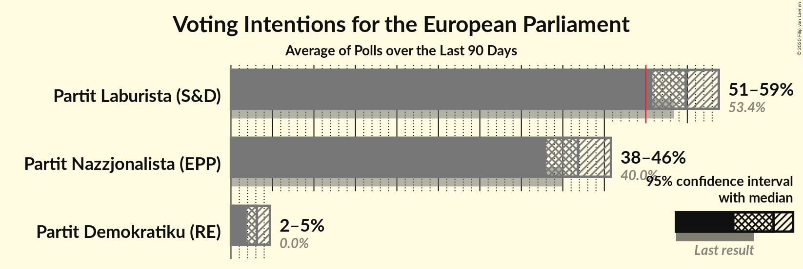

### Confidence Intervals

| Party | Last Result | Median | 80% Confidence Interval | 90% Confidence Interval | 95% Confidence Interval | 99% Confidence Interval |
|:-----:|:-----------:|:------:|:-----------------------:|:-----------------------:|:-----------------------:|:-----------------------:|
| <a href="#partit-laburista-(s&d)">Partit Laburista (S&D)</a> | 53.4% | 61.7% | 53.1–69.6% |52.2–70.4% | 51.5–71.0% | 50.1–72.2% |
| <a href="#partit-nazzjonalista-(epp)">Partit Nazzjonalista (EPP)</a> | 40.0% | 34.9% | 26.9–43.6% |26.2–44.4% | 25.5–45.2% | 24.4–46.6% |
| <a href="#alternattiva-demokratika-(greens/efa)">Alternattiva Demokratika (Greens/EFA)</a> | 2.9% | 2.2% | 1.6–3.1% |1.4–3.3% | 1.3–3.6% | 1.1–4.1% |
| <a href="#partit-demokratiku-(re)">Partit Demokratiku (RE)</a> | 0.0% | 3.1% | 2.3–4.1% |2.1–4.4% | 1.9–4.7% | 1.6–5.3% |
| <a href="#moviment-patrijotti-maltin-(id)">Moviment Patrijotti Maltin (ID)</a> | 0.0% | N/A | N/A |N/A | N/A | N/A |

### Partit Laburista (S&D)

*For a full overview of the results for this party, see the [Partit Laburista (S&D)](party-partitlaburistasd.html) page.*

| Voting Intentions | Probability | Accumulated | Special Marks |
|:-----------------:|:-----------:|:-----------:|:-------------:|
| 47.5–48.5% | 0% | 100% |  |
| 48.5–49.5% | 0.2% | 99.9% |  |
| 49.5–50.5% | 0.7% | 99.8% |  |
| 50.5–51.5% | 2% | 99.1% |  |
| 51.5–52.5% | 4% | 97% |  |
| 52.5–53.5% | 7% | 93% | Last Result |
| 53.5–54.5% | 9% | 87% |  |
| 54.5–55.5% | 10% | 78% |  |
| 55.5–56.5% | 8% | 68% |  |
| 56.5–57.5% | 5% | 60% |  |
| 57.5–58.5% | 3% | 54% |  |
| 58.5–59.5% | 1.2% | 52% |  |
| 59.5–60.5% | 0.4% | 50% |  |
| 60.5–61.5% | 0.1% | 50% |  |
| 61.5–62.5% | 0.1% | 50% | Median |
| 62.5–63.5% | 0.3% | 50% |  |
| 63.5–64.5% | 1.0% | 50% |  |
| 64.5–65.5% | 3% | 49% |  |
| 65.5–66.5% | 6% | 46% |  |
| 66.5–67.5% | 9% | 40% |  |
| 67.5–68.5% | 11% | 31% |  |
| 68.5–69.5% | 9% | 20% |  |
| 69.5–70.5% | 6% | 11% |  |
| 70.5–71.5% | 3% | 4% |  |
| 71.5–72.5% | 1.0% | 1.3% |  |
| 72.5–73.5% | 0.3% | 0.3% |  |
| 73.5–74.5% | 0% | 0% |  |
| 74.5–75.5% | 0% | 0% |  |

### Partit Nazzjonalista (EPP)

*For a full overview of the results for this party, see the [Partit Nazzjonalista (EPP)](party-partitnazzjonalistaepp.html) page.*

| Voting Intentions | Probability | Accumulated | Special Marks |
|:-----------------:|:-----------:|:-----------:|:-------------:|
| 21.5–22.5% | 0% | 100% |  |
| 22.5–23.5% | 0.1% | 100% |  |
| 23.5–24.5% | 0.5% | 99.9% |  |
| 24.5–25.5% | 2% | 99.4% |  |
| 25.5–26.5% | 5% | 97% |  |
| 26.5–27.5% | 9% | 93% |  |
| 27.5–28.5% | 11% | 84% |  |
| 28.5–29.5% | 10% | 73% |  |
| 29.5–30.5% | 7% | 63% |  |
| 30.5–31.5% | 4% | 56% |  |
| 31.5–32.5% | 1.4% | 52% |  |
| 32.5–33.5% | 0.4% | 51% |  |
| 33.5–34.5% | 0.1% | 50% |  |
| 34.5–35.5% | 0% | 50% | Median |
| 35.5–36.5% | 0.2% | 50% |  |
| 36.5–37.5% | 0.6% | 50% |  |
| 37.5–38.5% | 2% | 49% |  |
| 38.5–39.5% | 4% | 48% |  |
| 39.5–40.5% | 7% | 44% | Last Result |
| 40.5–41.5% | 9% | 37% |  |
| 41.5–42.5% | 10% | 28% |  |
| 42.5–43.5% | 8% | 18% |  |
| 43.5–44.5% | 5% | 10% |  |
| 44.5–45.5% | 3% | 5% |  |
| 45.5–46.5% | 1.2% | 2% |  |
| 46.5–47.5% | 0.4% | 0.5% |  |
| 47.5–48.5% | 0.1% | 0.1% |  |
| 48.5–49.5% | 0% | 0% |  |

### Alternattiva Demokratika (Greens/EFA)

*For a full overview of the results for this party, see the [Alternattiva Demokratika (Greens/EFA)](party-alternattivademokratikagreensefa.html) page.*

| Voting Intentions | Probability | Accumulated | Special Marks |
|:-----------------:|:-----------:|:-----------:|:-------------:|
| 0.0–0.5% | 0% | 100% |  |
| 0.5–1.5% | 9% | 100% |  |
| 1.5–2.5% | 60% | 91% | Median |
| 2.5–3.5% | 28% | 31% | Last Result |
| 3.5–4.5% | 3% | 3% |  |
| 4.5–5.5% | 0.1% | 0.1% |  |
| 5.5–6.5% | 0% | 0% |  |

### Partit Demokratiku (RE)

*For a full overview of the results for this party, see the [Partit Demokratiku (RE)](party-partitdemokratikure.html) page.*

| Voting Intentions | Probability | Accumulated | Special Marks |
|:-----------------:|:-----------:|:-----------:|:-------------:|
| 0.0–0.5% | 0% | 100% | Last Result |
| 0.5–1.5% | 0.3% | 100% |  |
| 1.5–2.5% | 20% | 99.7% |  |
| 2.5–3.5% | 53% | 80% | Median |
| 3.5–4.5% | 24% | 27% |  |
| 4.5–5.5% | 3% | 3% |  |
| 5.5–6.5% | 0.2% | 0.2% |  |
| 6.5–7.5% | 0% | 0% |  |

## Seats

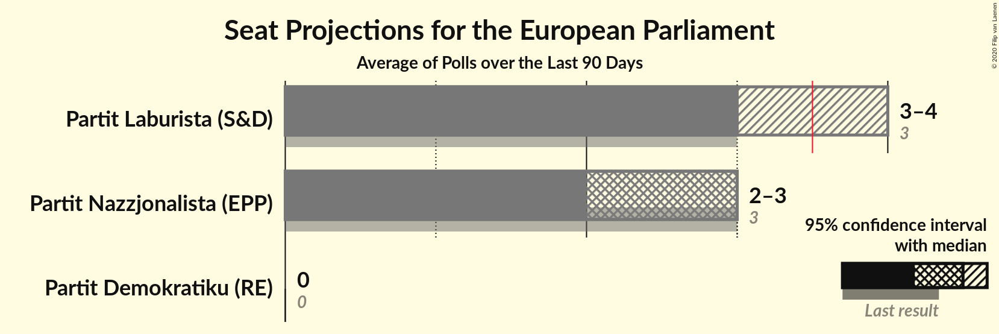

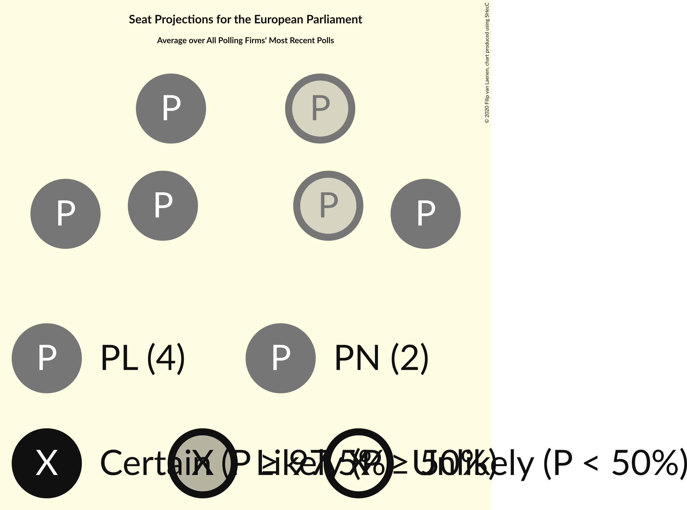

### Confidence Intervals

| Party | Last Result | Median | 80% Confidence Interval | 90% Confidence Interval | 95% Confidence Interval | 99% Confidence Interval |
|:-----:|:-----------:|:------:|:-----------------------:|:-----------------------:|:-----------------------:|:-----------------------:|
| <a href="#partit-laburista-(s&d)">Partit Laburista (S&D)</a> | 3 | 4 | 3–5 |3–5 | 3–5 | 3–5 |
| <a href="#partit-nazzjonalista-(epp)">Partit Nazzjonalista (EPP)</a> | 3 | 2 | 1–3 |1–3 | 1–3 | 1–3 |
| <a href="#alternattiva-demokratika-(greens/efa)">Alternattiva Demokratika (Greens/EFA)</a> | 0 | 0 | 0 |0 | 0 | 0 |
| <a href="#partit-demokratiku-(re)">Partit Demokratiku (RE)</a> | 0 | 0 | 0 |0 | 0 | 0 |
| <a href="#moviment-patrijotti-maltin-(id)">Moviment Patrijotti Maltin (ID)</a> | 0 | N/A | N/A |N/A | N/A | N/A |

### Partit Laburista (S&D)

*For a full overview of the results for this party, see the [Partit Laburista (S&D)](party-partitlaburistasd.html) page.*

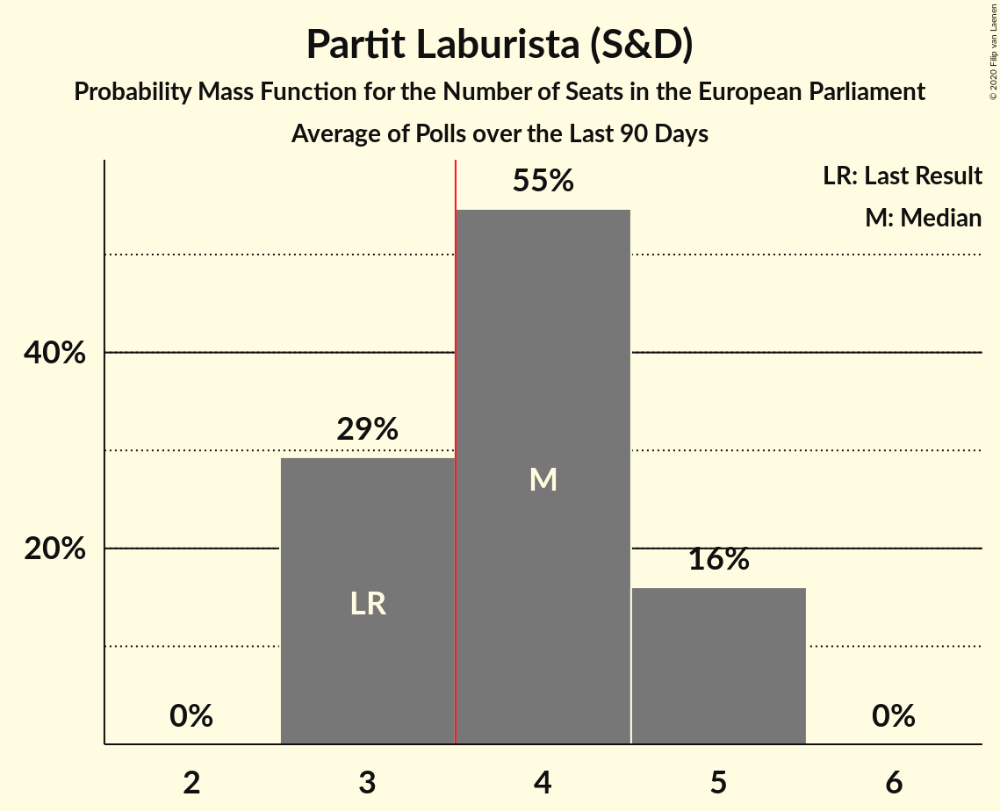

| Number of Seats | Probability | Accumulated | Special Marks |
|:---------------:|:-----------:|:-----------:|:-------------:|
| 3 | 29% | 100% | Last Result |
| 4 | 55% | 71% | Median, Majority |
| 5 | 16% | 16% |  |
| 6 | 0% | 0% |  |

### Partit Nazzjonalista (EPP)

*For a full overview of the results for this party, see the [Partit Nazzjonalista (EPP)](party-partitnazzjonalistaepp.html) page.*

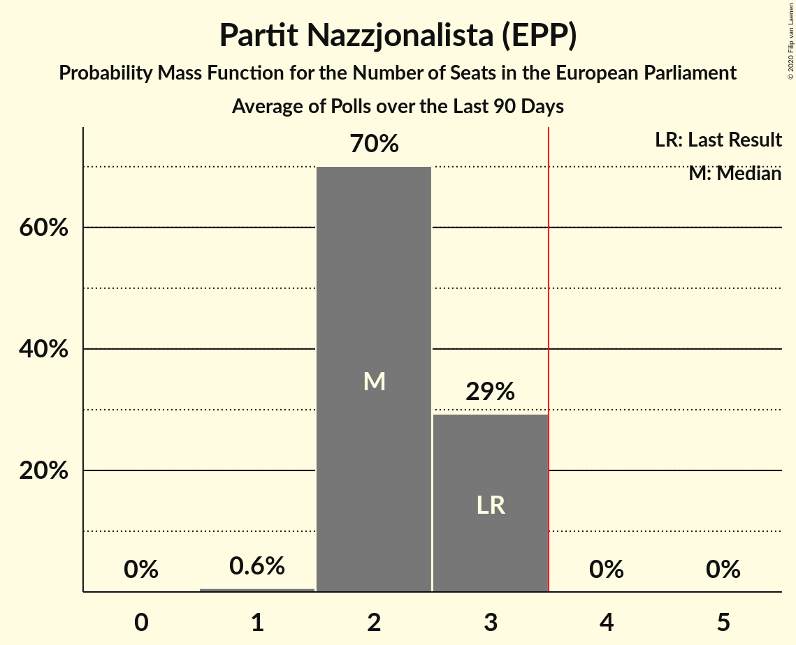

| Number of Seats | Probability | Accumulated | Special Marks |
|:---------------:|:-----------:|:-----------:|:-------------:|
| 1 | 16% | 100% |  |
| 2 | 55% | 84% | Median |
| 3 | 29% | 29% | Last Result |
| 4 | 0% | 0% | Majority |

### Alternattiva Demokratika (Greens/EFA)

*For a full overview of the results for this party, see the [Alternattiva Demokratika (Greens/EFA)](party-alternattivademokratikagreensefa.html) page.*

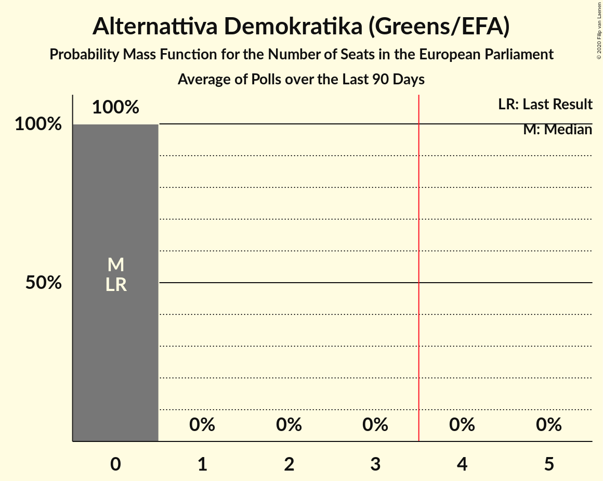

| Number of Seats | Probability | Accumulated | Special Marks |
|:---------------:|:-----------:|:-----------:|:-------------:|
| 0 | 100% | 100% | Last Result, Median |

### Partit Demokratiku (RE)

*For a full overview of the results for this party, see the [Partit Demokratiku (RE)](party-partitdemokratikure.html) page.*

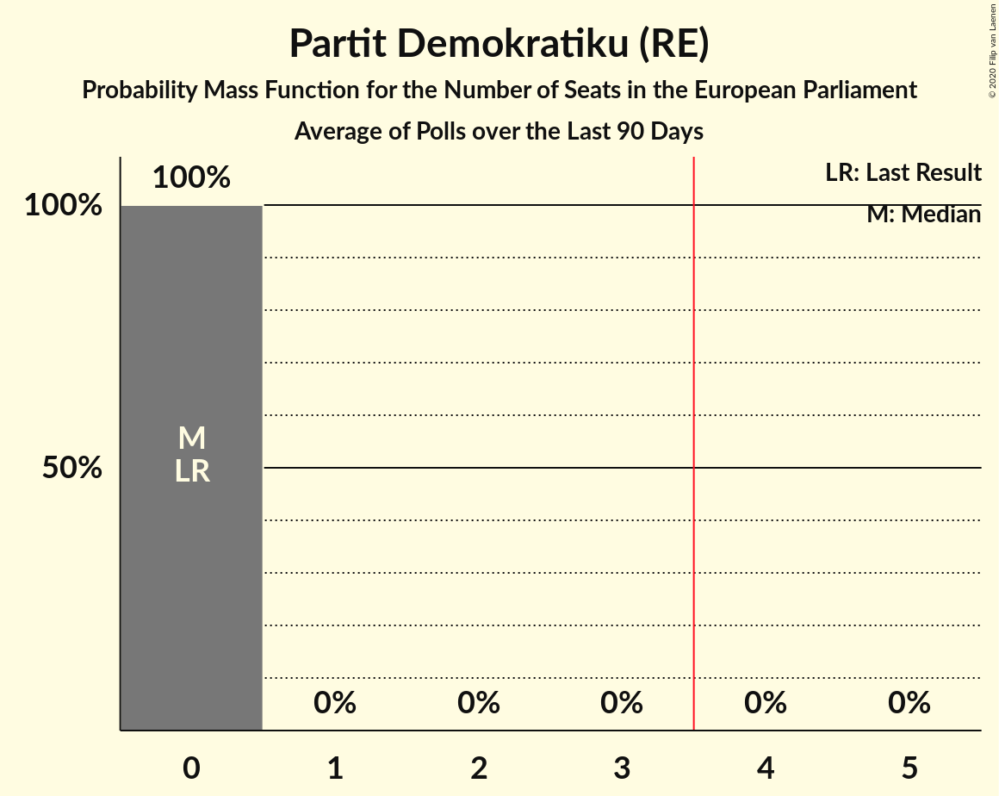

| Number of Seats | Probability | Accumulated | Special Marks |
|:---------------:|:-----------:|:-----------:|:-------------:|
| 0 | 100% | 100% | Last Result, Median |

### Moviment Patrijotti Maltin (ID)

*For a full overview of the results for this party, see the [Moviment Patrijotti Maltin (ID)](party-movimentpatrijottimaltinid.html) page.*

## Coalitions

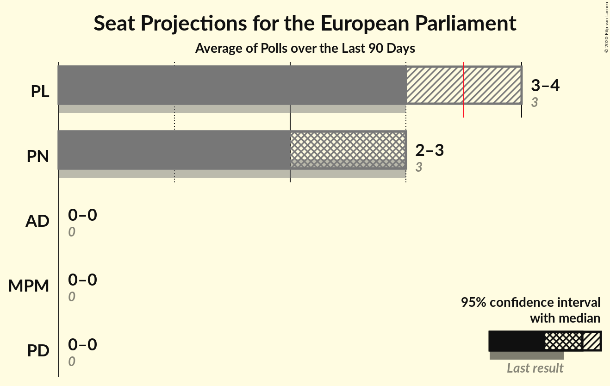

### Confidence Intervals

| Coalition | Last Result | Median | Majority? | 80% Confidence Interval | 90% Confidence Interval | 95% Confidence Interval | 99% Confidence Interval |
|:---------:|:-----------:|:------:|:---------:|:-----------------------:|:-----------------------:|:-----------------------:|:-----------------------:|
| Partit Laburista (S&D) | 3 | 4 | 71% | 3–5 | 3–5 | 3–5 | 3–5 |
| Partit Nazzjonalista (EPP) | 3 | 2 | 0% | 1–3 | 1–3 | 1–3 | 1–3 |
| Alternattiva Demokratika (Greens/EFA) | 0 | 0 | 0% | 0 | 0 | 0 | 0 |
| Moviment Patrijotti Maltin (ID) | 0 | 0 | 0% | 0 | 0 | 0 | 0 |
| Partit Demokratiku (RE) | 0 | 0 | 0% | 0 | 0 | 0 | 0 |

### Partit Laburista (S&D)

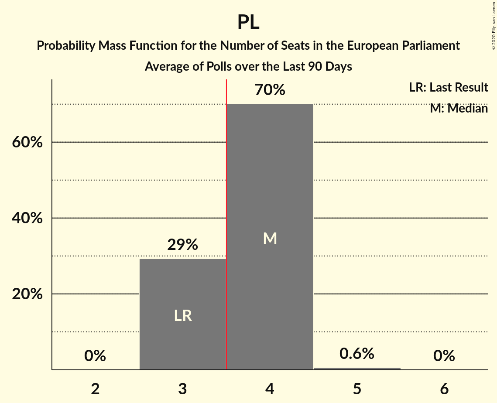

| Number of Seats | Probability | Accumulated | Special Marks |
|:---------------:|:-----------:|:-----------:|:-------------:|
| 3 | 29% | 100% | Last Result |
| 4 | 55% | 71% | Median, Majority |
| 5 | 16% | 16% |  |
| 6 | 0% | 0% |  |

### Partit Nazzjonalista (EPP)

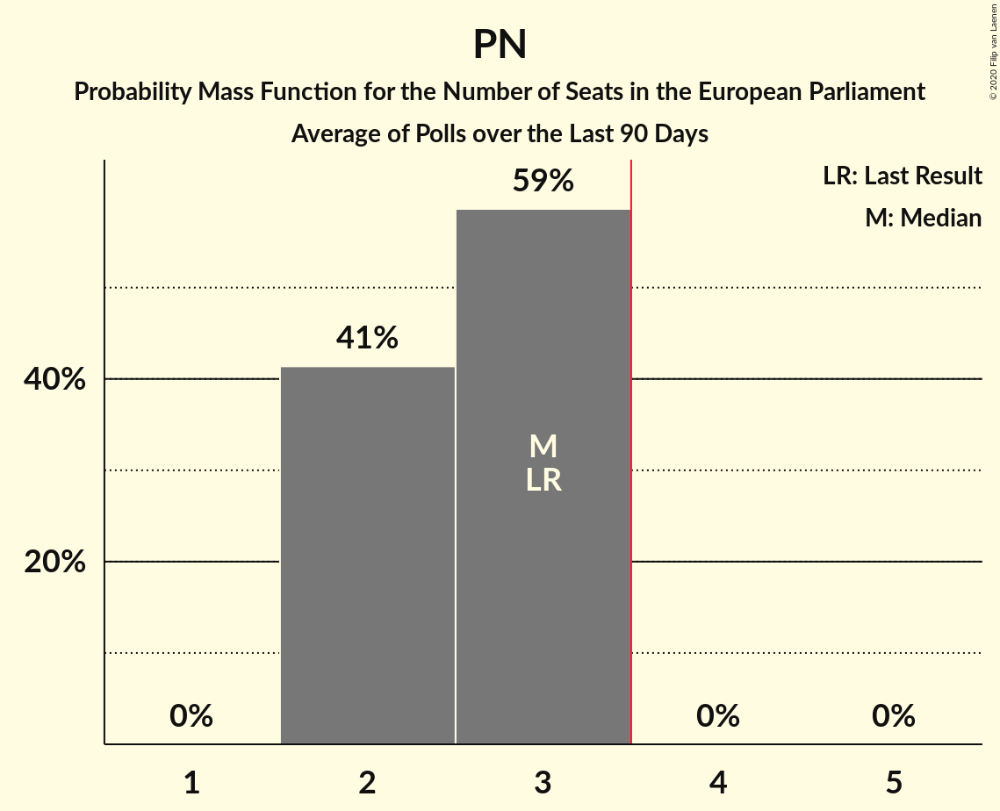

| Number of Seats | Probability | Accumulated | Special Marks |
|:---------------:|:-----------:|:-----------:|:-------------:|
| 1 | 16% | 100% |  |
| 2 | 55% | 84% | Median |
| 3 | 29% | 29% | Last Result |
| 4 | 0% | 0% | Majority |

### Alternattiva Demokratika (Greens/EFA)

| Number of Seats | Probability | Accumulated | Special Marks |
|:---------------:|:-----------:|:-----------:|:-------------:|
| 0 | 100% | 100% | Last Result, Median |

### Moviment Patrijotti Maltin (ID)

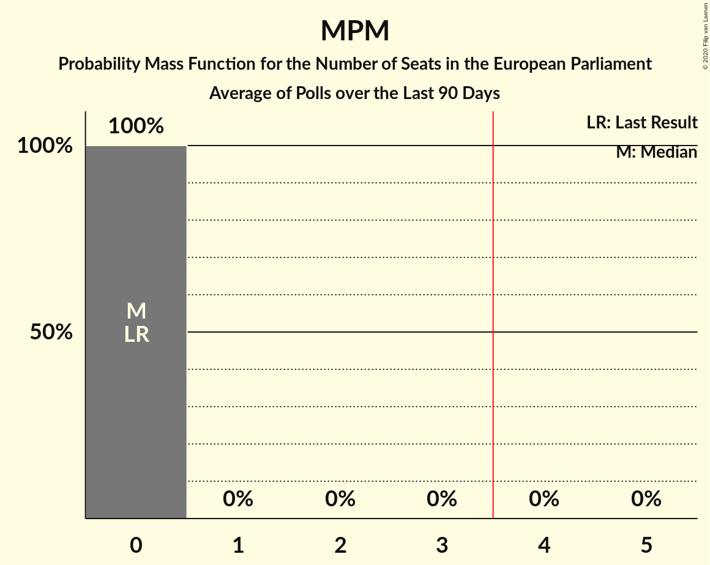

| Number of Seats | Probability | Accumulated | Special Marks |
|:---------------:|:-----------:|:-----------:|:-------------:|
| 0 | 100% | 100% | Last Result, Median |

### Partit Demokratiku (RE)

| Number of Seats | Probability | Accumulated | Special Marks |
|:---------------:|:-----------:|:-----------:|:-------------:|
| 0 | 100% | 100% | Last Result, Median |

## Technical Information

+ **Number of polls included in this average:** 2
+ **Lowest number of simulations done in a poll included in this average:** 1,048,576
+ **Total number of simulations done in the polls included in this average:** 2,097,152
+ **Error estimate:** 0.17%
