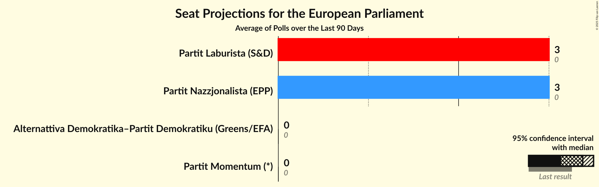

# Overview

The table below lists the most recent polls (less than 90 days old) registered and analyzed so far.

| Period     | Polling firm/Commissioner(s) | AD | AD+PD | PL | PD | PN | MPM | IE |
|:----------:|:----------------------------:|:--:|:--:|:--:|:--:|:--:|:--:|:--:|
| 8 June 2024 | General Election | 0.0%   0 | 0.0%   0 | 0.0%   0 | 0.0%   0 | 0.0%   0 | 0.0%   0 | 0.0%   0 |
| N/A | [Poll Average](average.html) | N/A   N/A | 3–6%   0 | 40–51%   3 | N/A   N/A | 41–52%   3 | N/A   N/A | N/A   N/A |
| [2–9 October 2024](2024-10-09-Sagalytics.html) | Sagalytics   It-Torċa | N/A   N/A | 3–6%   0 | 45–52%   3 | N/A   N/A | 41–48%   3 | N/A   N/A | N/A   N/A |
| [11–19 September 2024](2024-09-19-MaltaToday.html) | MaltaToday | N/A   N/A | 3–7%   0 | 40–48%   3 | N/A   N/A | 44–52%   3 | N/A   N/A | N/A   N/A |
| 8 June 2024 | General Election | 0.0%   0 | 0.0%   0 | 0.0%   0 | 0.0%   0 | 0.0%   0 | 0.0%   0 | 0.0%   0 |

Only polls for which at least the sample size has been published are included in the table above.

**Legend:**
+ **Top half of each row:** Voting intentions (95% confidence interval)
+ **Bottom half of each row:** Seat projections for the European Parliament (95% confidence interval)
+ **AD:** Alternattiva Demokratika (Greens/EFA)
+ **AD+PD:** Alternattiva Demokratika–Partit Demokratiku (Greens/EFA)
+ **PL:** Partit Laburista (S&D)
+ **PD:** Partit Demokratiku (RE)
+ **PN:** Partit Nazzjonalista (EPP)
+ **MPM:** Moviment Patrijotti Maltin (PfE)
+ **IE:** Imperium Europa (*)
+ **N/A (single party):** Party not included the published results
+ **N/A (entire row):** Calculation for this opinion poll not started yet

