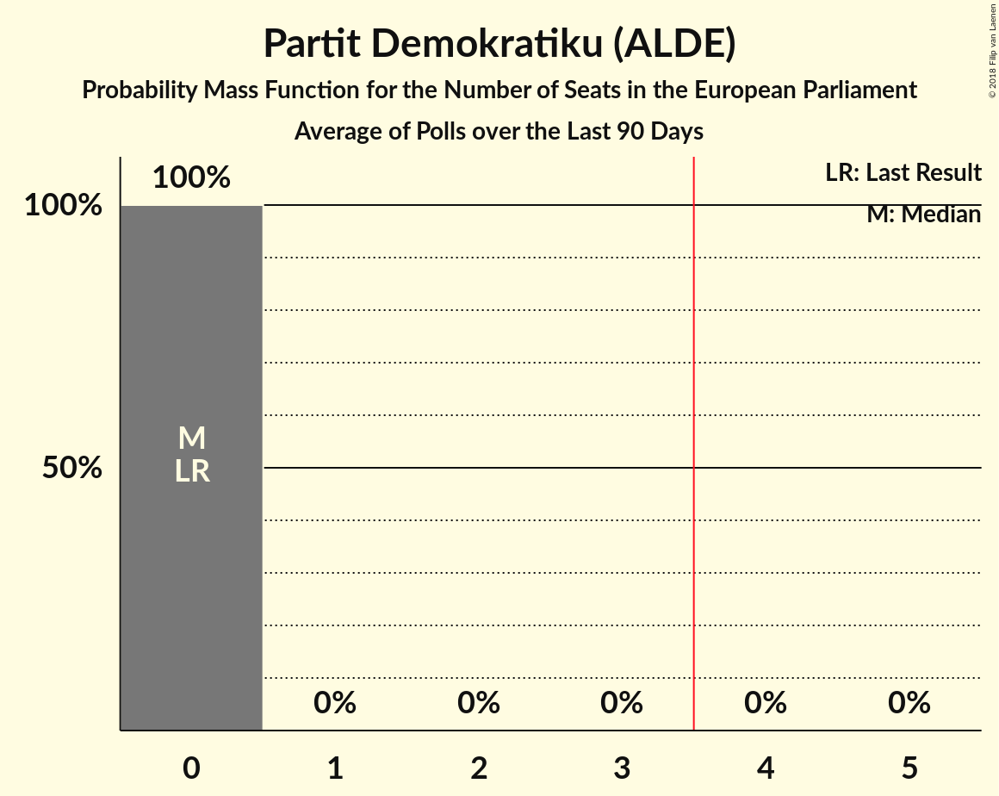

# Partit Demokratiku (ALDE)

<a href="#voting-intentions">Voting Intentions</a> | <a href="#seats">Seats</a>

## Voting Intentions

Last result: **0.0%** (General Election of 25 May 2014)

### Confidence Intervals

| Period     | Polling firm/Commissioner(s) | Median | 80% Confidence Interval | 90% Confidence Interval | 95% Confidence Interval | 99% Confidence Interval |
|:----------:|:----------------:|:-----------:|:-----------------------:|:-----------------------:|:-----------------------:|:-----------------------:|
| N/A | [Poll Average](average.html) | 0.6% | 0.2–1.1% | 0.2–1.3% | 0.1–1.5% | 0.1–1.9% |
| [1–6 October 2018](2018-10-06-MaltaToday.html) | MaltaToday | 0.4% | 0.2–1.1% | 0.2–1.3% | 0.1–1.5% | 0.1–2.0% |
| [27–30 August 2018](2018-08-30-MaltaToday.html) | MaltaToday | 1.8% | 1.2–2.9% | 1.0–3.2% | 0.9–3.5% | 0.7–4.1% |
| [27 July–2 August 2018](2018-08-02-MaltaToday.html) | MaltaToday | 0.0% | N/A | N/A | N/A | N/A |
| [26–27 July 2018](2018-07-27-Esprimi.html) | Esprimi   Lovin Malta | 0.0% | N/A | N/A | N/A | N/A |
| [28–31 May 2018](2018-05-31-MaltaToday.html) | MaltaToday | 0.5% | 0.2–1.2% | 0.2–1.5% | 0.1–1.7% | 0.1–2.1% |
| [23–27 April 2018](2018-04-27-MaltaToday.html) | MaltaToday | 0.0% | N/A | N/A | N/A | N/A |
| [26 February–1 March 2018](2018-03-01-MaltaToday.html) | MaltaToday | 2.8% | 2.0–4.2% | 1.8–4.6% | 1.6–5.0% | 1.3–5.7% |
| [12–20 February 2018](2018-02-20-Sagalytics.html) | Sagalytics   It-Torċa | 0.0% | N/A | N/A | N/A | N/A |
| [23–29 January 2018](2018-01-29-MaltaToday.html) | MaltaToday | 0.0% | N/A | N/A | N/A | N/A |

### Probability Mass Function

The following table shows the probability mass function per percentage block of voting intentions for the [poll average](average.html) for Partit Demokratiku (ALDE).

| Voting Intentions | Probability | Accumulated | Special Marks |
|:-----------------:|:-----------:|:-----------:|:-------------:|
| 0.0–0.5% | 48% | 100% | Last Result |
| 0.5–1.5% | 50% | 52% | Median |
| 1.5–2.5% | 2% | 2% |  |
| 2.5–3.5% | 0% | 0% |  |
| 3.5–4.5% | 0% | 0% |  |

## Seats

Last result: **0** seats (General Election of 25 May 2014)

### Confidence Intervals

| Period     | Polling firm/Commissioner(s) | Median | 80% Confidence Interval | 90% Confidence Interval | 95% Confidence Interval | 99% Confidence Interval |
|:----------:|:----------------:|:------:|:-----------------------:|:-----------------------:|:-----------------------:|:-----------------------:|
| N/A | [Poll Average](average.html) | 0 | 0 | 0 | 0 | 0 |
| [1–6 October 2018](2018-10-06-MaltaToday.html) | MaltaToday | 0 | 0 | 0 | 0 | 0 |
| [27–30 August 2018](2018-08-30-MaltaToday.html) | MaltaToday | 0 | 0 | 0 | 0 | 0 |
| [27 July–2 August 2018](2018-08-02-MaltaToday.html) | MaltaToday |  |  |  |  |  |
| [26–27 July 2018](2018-07-27-Esprimi.html) | Esprimi   Lovin Malta |  |  |  |  |  |
| [28–31 May 2018](2018-05-31-MaltaToday.html) | MaltaToday | 0 | 0 | 0 | 0 | 0 |
| [23–27 April 2018](2018-04-27-MaltaToday.html) | MaltaToday |  |  |  |  |  |
| [26 February–1 March 2018](2018-03-01-MaltaToday.html) | MaltaToday | 0 | 0 | 0 | 0 | 0 |
| [12–20 February 2018](2018-02-20-Sagalytics.html) | Sagalytics   It-Torċa |  |  |  |  |  |
| [23–29 January 2018](2018-01-29-MaltaToday.html) | MaltaToday |  |  |  |  |  |

### Probability Mass Function

The following table shows the probability mass function per seat for the [poll average](average.html) for Partit Demokratiku (ALDE).

| Number of Seats | Probability | Accumulated | Special Marks |
|:---------------:|:-----------:|:-----------:|:-------------:|
| 0 | 100% | 100% | Last Result, Median |

