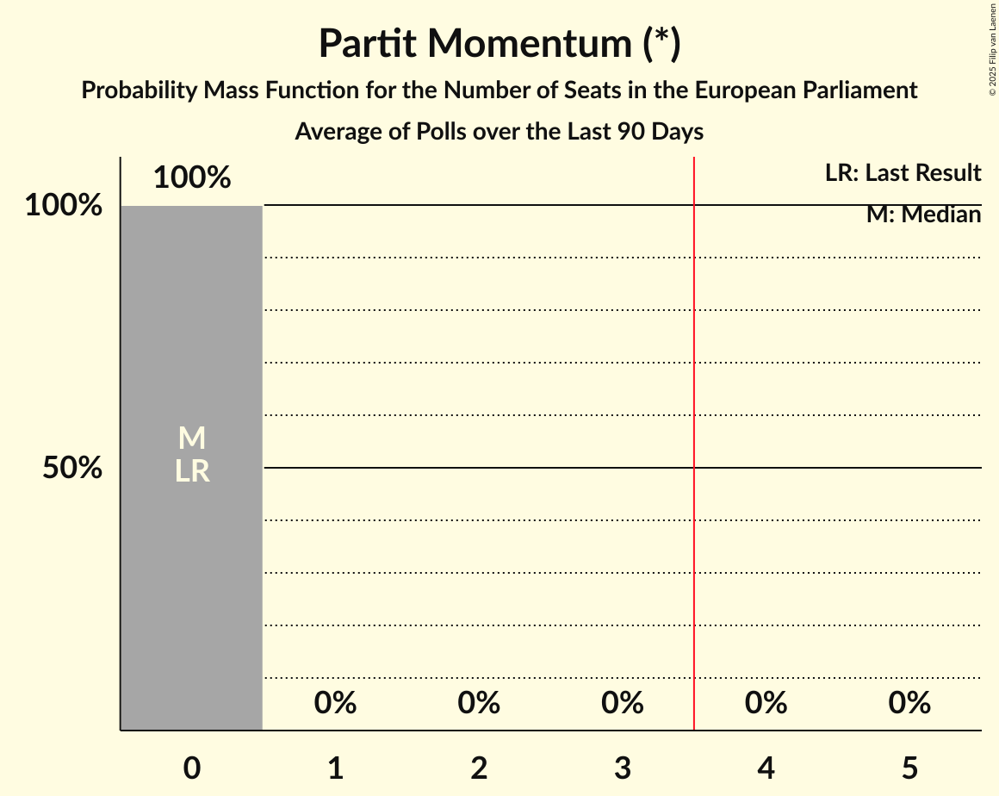

# Partit Momentum (*)

<a href="#voting-intentions">Voting Intentions</a> | <a href="#seats">Seats</a>

## Voting Intentions

Last result: **0.0%** (General Election of 8 June 2024)

### Confidence Intervals

| Period     | Polling firm/Commissioner(s) | Median | 80% Confidence Interval | 90% Confidence Interval | 95% Confidence Interval | 99% Confidence Interval |
|:----------:|:----------------:|:-----------:|:-----------------------:|:-----------------------:|:-----------------------:|:-----------------------:|
| N/A | [Poll Average](average.html) | 4.1% | 3.2–5.2% | 3.0–5.5% | 2.8–5.8% | 2.4–6.4% |
| [30 January–12 February 2025](2025-02-12-Esprimi.html) | Esprimi   Times of Malta | 0.0% | N/A | N/A | N/A | N/A |
| [29–13 January 2025](2025-01-13-MaltaToday.html) | MaltaToday | 4.0% | 3.2–5.2% | 3.0–5.5% | 2.8–5.8% | 2.4–6.4% |
| [5–13 November 2024](2024-11-13-MaltaToday.html) | MaltaToday | 0.0% | N/A | N/A | N/A | N/A |
| [2–9 October 2024](2024-10-09-Sagalytics.html) | Sagalytics   It-Torċa | 0.0% | N/A | N/A | N/A | N/A |
| [11–19 September 2024](2024-09-19-MaltaToday.html) | MaltaToday | 0.0% | N/A | N/A | N/A | N/A |

### Probability Mass Function

The following table shows the probability mass function per percentage block of voting intentions for the [poll average](average.html) for Partit Momentum (*).

| Voting Intentions | Probability | Accumulated | Special Marks |
|:-----------------:|:-----------:|:-----------:|:-------------:|
| 0.0–0.5% | 0% | 100% | Last Result |
| 0.5–1.5% | 0% | 100% |  |
| 1.5–2.5% | 0.9% | 100% |  |
| 2.5–3.5% | 21% | 99.1% |  |
| 3.5–4.5% | 49% | 78% | Median |
| 4.5–5.5% | 24% | 28% |  |
| 5.5–6.5% | 4% | 4% |  |
| 6.5–7.5% | 0.3% | 0.3% |  |
| 7.5–8.5% | 0% | 0% |  |

## Seats

Last result: **0** seats (General Election of 8 June 2024)

### Confidence Intervals

| Period     | Polling firm/Commissioner(s) | Median | 80% Confidence Interval | 90% Confidence Interval | 95% Confidence Interval | 99% Confidence Interval |
|:----------:|:----------------:|:------:|:-----------------------:|:-----------------------:|:-----------------------:|:-----------------------:|
| N/A | [Poll Average](average.html) | 0 | 0 | 0 | 0 | 0 |
| [30 January–12 February 2025](2025-02-12-Esprimi.html) | Esprimi   Times of Malta |  |  |  |  |  |
| [29–13 January 2025](2025-01-13-MaltaToday.html) | MaltaToday | 0 | 0 | 0 | 0 | 0 |
| [5–13 November 2024](2024-11-13-MaltaToday.html) | MaltaToday |  |  |  |  |  |
| [2–9 October 2024](2024-10-09-Sagalytics.html) | Sagalytics   It-Torċa |  |  |  |  |  |
| [11–19 September 2024](2024-09-19-MaltaToday.html) | MaltaToday |  |  |  |  |  |

### Probability Mass Function

The following table shows the probability mass function per seat for the [poll average](average.html) for Partit Momentum (*).

| Number of Seats | Probability | Accumulated | Special Marks |
|:---------------:|:-----------:|:-----------:|:-------------:|
| 0 | 100% | 100% | Last Result, Median |

