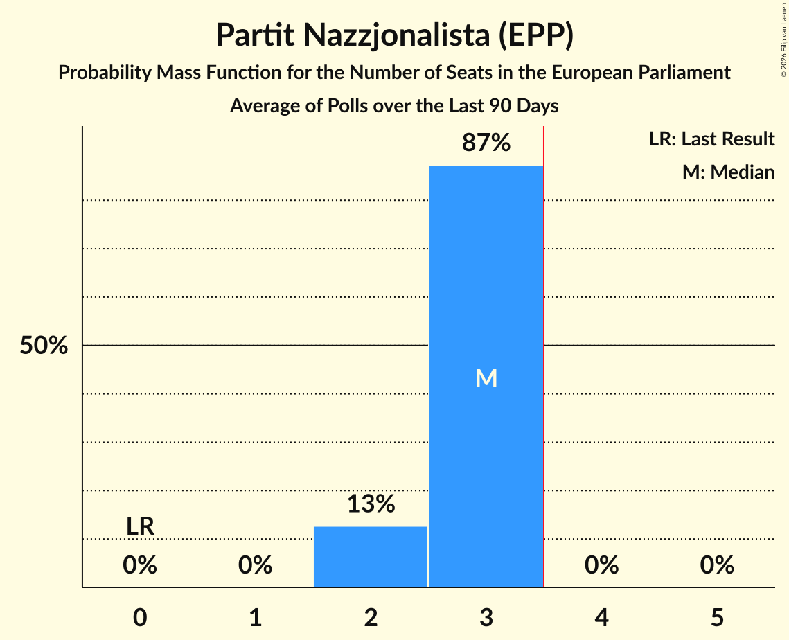

# Partit Nazzjonalista (EPP)

<a href="#voting-intentions">Voting Intentions</a> | <a href="#seats">Seats</a>

## Voting Intentions

Last result: **0.0%** (General Election of 8 June 2024)

### Confidence Intervals

| Period     | Polling firm/Commissioner(s) | Median | 80% Confidence Interval | 90% Confidence Interval | 95% Confidence Interval | 99% Confidence Interval |
|:----------:|:----------------:|:-----------:|:-----------------------:|:-----------------------:|:-----------------------:|:-----------------------:|
| N/A | [Poll Average](average.html) | 43.4% | 41.1–45.9% | 40.5–46.6% | 40.0–47.3% | 39.0–48.5% |
| [13–24 May 2026](2026-05-24-MaltaToday.html) | MaltaToday | 44.2% | 42.3–46.1% | 41.7–46.7% | 41.3–47.2% | 40.4–48.1% |
| [14–20 May 2026](2026-05-20-Sagalytics.html) | Sagalytics | 42.2% | 40.5–43.9% | 40.0–44.4% | 39.6–44.8% | 38.8–45.7% |
| [7–13 May 2026](2026-05-13-Sagalytics.html) | Sagalytics | 41.5% | N/A | N/A | N/A | N/A |
| [29 April–13 May 2026](2026-05-13-MaltaToday.html) | MaltaToday | 43.8% | 41.9–45.8% | 41.4–46.3% | 40.9–46.8% | 40.0–47.7% |
| [6–13 May 2026](2026-05-13-Esprimi.html) | Esprimi   Times of Malta | 44.0% | 41.4–46.6% | 40.7–47.4% | 40.1–48.0% | 38.9–49.3% |
| [30 April–6 May 2026](2026-05-06-Sagalytics.html) | Sagalytics | 41.9% | N/A | N/A | N/A | N/A |
| [23–29 April 2026](2026-04-29-Sagalytics.html) | Sagalytics | 42.2% | 40.3–44.2% | 39.8–44.8% | 39.3–45.2% | 38.4–46.2% |
| [9–16 April 2026](2026-04-16-Esprimi.html) | Esprimi   Times of Malta | 45.0% | 42.2–47.9% | 41.4–48.7% | 40.8–49.4% | 39.4–50.8% |
| [23 February–6 March 2026](2026-03-06-MaltaToday.html) | MaltaToday | 45.7% | 43.1–48.2% | 42.4–48.9% | 41.8–49.6% | 40.6–50.8% |
| [13–19 February 2026](2026-02-19-Sagalytics.html) | Sagalytics   The Malta Independent | 43.3% | 41.4–45.3% | 40.8–45.8% | 40.3–46.3% | 39.4–47.2% |
| [5–16 January 2026](2026-01-16-MaltaToday.html) | MaltaToday | 45.8% | 43.5–48.0% | 42.9–48.7% | 42.4–49.2% | 41.3–50.3% |
| [13–20 November 2025](2025-11-20-Sagalytics.html) | Sagalytics   The Malta Independent | 43.5% | 41.7–45.3% | 41.2–45.9% | 40.7–46.3% | 39.9–47.2% |
| [24 September–2 October 2025](2025-10-02-MaltaToday.html) | MaltaToday | 45.8% | 43.2–48.4% | 42.5–49.1% | 41.9–49.8% | 40.6–51.0% |
| [28 May–6 June 2025](2025-06-06-MaltaToday.html) | MaltaToday | 39.7% | 37.3–42.2% | 36.6–42.9% | 36.0–43.5% | 34.9–44.7% |
| [28 March–8 April 2025](2025-04-08-MaltaToday.html) | MaltaToday | 42.8% | 40.4–45.4% | 39.7–46.1% | 39.1–46.7% | 37.9–47.9% |
| [29 January–13 February 2025](2025-02-13-MaltaToday.html) | MaltaToday | 44.0% | 41.2–46.8% | 40.4–47.6% | 39.7–48.3% | 38.4–49.7% |
| [30 January–12 February 2025](2025-02-12-Esprimi.html) | Esprimi   Times of Malta | 45.0% | 42.4–47.6% | 41.7–48.4% | 41.1–49.0% | 39.8–50.3% |
| [1–6 February 2025](2025-02-06-Sagalytics.html) | Sagalytics | 44.2% | 42.3–46.0% | 41.8–46.5% | 41.4–47.0% | 40.5–47.9% |
| [5–13 November 2024](2024-11-13-MaltaToday.html) | MaltaToday | 46.3% | N/A | N/A | N/A | N/A |
| [2–9 October 2024](2024-10-09-Sagalytics.html) | Sagalytics   It-Torċa | 44.1% | N/A | N/A | N/A | N/A |
| [11–19 September 2024](2024-09-19-MaltaToday.html) | MaltaToday | 48.2% | N/A | N/A | N/A | N/A |

### Probability Mass Function

The following table shows the probability mass function per percentage block of voting intentions for the [poll average](average.html) for Partit Nazzjonalista (EPP).

| Voting Intentions | Probability | Accumulated | Special Marks |
|:-----------------:|:-----------:|:-----------:|:-------------:|
| 0.0–0.5% | 0% | 100% | Last Result |
| 0.5–1.5% | 0% | 100% |  |
| 1.5–2.5% | 0% | 100% |  |
| 2.5–3.5% | 0% | 100% |  |
| 3.5–4.5% | 0% | 100% |  |
| 4.5–5.5% | 0% | 100% |  |
| 5.5–6.5% | 0% | 100% |  |
| 6.5–7.5% | 0% | 100% |  |
| 7.5–8.5% | 0% | 100% |  |
| 8.5–9.5% | 0% | 100% |  |
| 9.5–10.5% | 0% | 100% |  |
| 10.5–11.5% | 0% | 100% |  |
| 11.5–12.5% | 0% | 100% |  |
| 12.5–13.5% | 0% | 100% |  |
| 13.5–14.5% | 0% | 100% |  |
| 14.5–15.5% | 0% | 100% |  |
| 15.5–16.5% | 0% | 100% |  |
| 16.5–17.5% | 0% | 100% |  |
| 17.5–18.5% | 0% | 100% |  |
| 18.5–19.5% | 0% | 100% |  |
| 19.5–20.5% | 0% | 100% |  |
| 20.5–21.5% | 0% | 100% |  |
| 21.5–22.5% | 0% | 100% |  |
| 22.5–23.5% | 0% | 100% |  |
| 23.5–24.5% | 0% | 100% |  |
| 24.5–25.5% | 0% | 100% |  |
| 25.5–26.5% | 0% | 100% |  |
| 26.5–27.5% | 0% | 100% |  |
| 27.5–28.5% | 0% | 100% |  |
| 28.5–29.5% | 0% | 100% |  |
| 29.5–30.5% | 0% | 100% |  |
| 30.5–31.5% | 0% | 100% |  |
| 31.5–32.5% | 0% | 100% |  |
| 32.5–33.5% | 0% | 100% |  |
| 33.5–34.5% | 0% | 100% |  |
| 34.5–35.5% | 0% | 100% |  |
| 35.5–36.5% | 0% | 100% |  |
| 36.5–37.5% | 0% | 100% |  |
| 37.5–38.5% | 0.2% | 100% |  |
| 38.5–39.5% | 1.0% | 99.8% |  |
| 39.5–40.5% | 4% | 98.8% |  |
| 40.5–41.5% | 10% | 95% |  |
| 41.5–42.5% | 17% | 85% |  |
| 42.5–43.5% | 20% | 68% | Median |
| 43.5–44.5% | 19% | 47% |  |
| 44.5–45.5% | 14% | 28% |  |
| 45.5–46.5% | 8% | 14% |  |
| 46.5–47.5% | 4% | 6% |  |
| 47.5–48.5% | 1.3% | 2% |  |
| 48.5–49.5% | 0.4% | 0.5% |  |
| 49.5–50.5% | 0.1% | 0.1% |  |
| 50.5–51.5% | 0% | 0% |  |

## Seats

Last result: **0** seats (General Election of 8 June 2024)

### Confidence Intervals

| Period     | Polling firm/Commissioner(s) | Median | 80% Confidence Interval | 90% Confidence Interval | 95% Confidence Interval | 99% Confidence Interval |
|:----------:|:----------------:|:------:|:-----------------------:|:-----------------------:|:-----------------------:|:-----------------------:|
| N/A | [Poll Average](average.html) | 3 | 2–3 | 2–3 | 2–3 | 2–3 |
| [13–24 May 2026](2026-05-24-MaltaToday.html) | MaltaToday | 3 | 3 | 3 | 3 | 2–3 |
| [14–20 May 2026](2026-05-20-Sagalytics.html) | Sagalytics | 3 | 2–3 | 2–3 | 2–3 | 2–3 |
| [7–13 May 2026](2026-05-13-Sagalytics.html) | Sagalytics |  |  |  |  |  |
| [29 April–13 May 2026](2026-05-13-MaltaToday.html) | MaltaToday | 3 | 3 | 3 | 3 | 2–3 |
| [6–13 May 2026](2026-05-13-Esprimi.html) | Esprimi   Times of Malta | 3 | 2–3 | 2–3 | 2–3 | 2–3 |
| [30 April–6 May 2026](2026-05-06-Sagalytics.html) | Sagalytics |  |  |  |  |  |
| [23–29 April 2026](2026-04-29-Sagalytics.html) | Sagalytics | 3 | 2–3 | 2–3 | 2–3 | 2–3 |
| [9–16 April 2026](2026-04-16-Esprimi.html) | Esprimi   Times of Malta | 3 | 3 | 3 | 2–3 | 2–3 |
| [23 February–6 March 2026](2026-03-06-MaltaToday.html) | MaltaToday | 3 | 3 | 3 | 3 | 3 |
| [13–19 February 2026](2026-02-19-Sagalytics.html) | Sagalytics   The Malta Independent | 3 | 3 | 2–3 | 2–3 | 2–3 |
| [5–16 January 2026](2026-01-16-MaltaToday.html) | MaltaToday | 3 | 3 | 3 | 3 | 3 |
| [13–20 November 2025](2025-11-20-Sagalytics.html) | Sagalytics   The Malta Independent | 3 | 3 | 3 | 2–3 | 2–3 |
| [24 September–2 October 2025](2025-10-02-MaltaToday.html) | MaltaToday | 3 | 3 | 3 | 3 | 3 |
| [28 May–6 June 2025](2025-06-06-MaltaToday.html) | MaltaToday | 2 | 2–3 | 2–3 | 2–3 | 2–3 |
| [28 March–8 April 2025](2025-04-08-MaltaToday.html) | MaltaToday | 3 | 2–3 | 2–3 | 2–3 | 2–3 |
| [29 January–13 February 2025](2025-02-13-MaltaToday.html) | MaltaToday | 3 | 3 | 3 | 3 | 2–3 |
| [30 January–12 February 2025](2025-02-12-Esprimi.html) | Esprimi   Times of Malta | 3 | 3 | 3 | 2–3 | 2–3 |
| [1–6 February 2025](2025-02-06-Sagalytics.html) | Sagalytics | 3 | 3 | 3 | 3 | 3 |
| [5–13 November 2024](2024-11-13-MaltaToday.html) | MaltaToday |  |  |  |  |  |
| [2–9 October 2024](2024-10-09-Sagalytics.html) | Sagalytics   It-Torċa |  |  |  |  |  |
| [11–19 September 2024](2024-09-19-MaltaToday.html) | MaltaToday |  |  |  |  |  |

### Probability Mass Function

The following table shows the probability mass function per seat for the [poll average](average.html) for Partit Nazzjonalista (EPP).

| Number of Seats | Probability | Accumulated | Special Marks |
|:---------------:|:-----------:|:-----------:|:-------------:|
| 0 | 0% | 100% | Last Result |
| 1 | 0% | 100% |  |
| 2 | 13% | 100% |  |
| 3 | 87% | 87% | Median |
| 4 | 0% | 0% | Majority |

